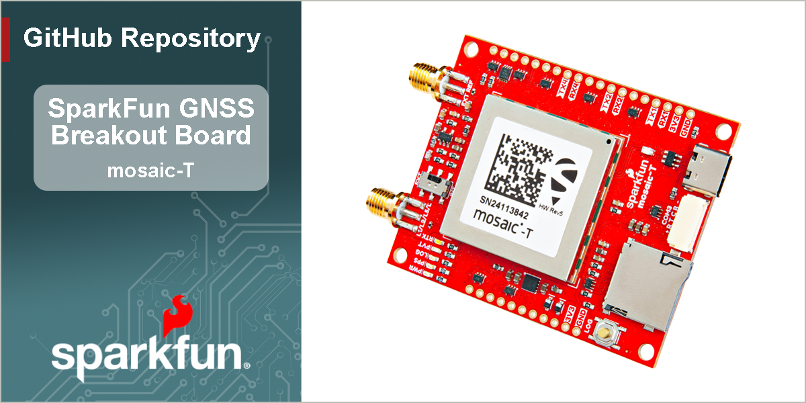

SparkFun Timing GNSS Breakout - mosaic-T
========================================

[*SparkFun Timing GNSS Breakout - mosaic-T (GPS-28731)*](https://www.sparkfun.com/sparkfun-timing-gnss-breakout-mosaic-t.html)

At the heart of our Timing GNSS Breakout is [Septentrio](https://www.septentrio.com/en)'s mosaic-T, a compact, ultra-low power, multi-band, multi-constellation, high-precision GNSS timing receiver. It can acheive a timing precision of 5ns (5 billionths of a second), or better than 1ns with an optional subscription to the Fugro AtomiChron® L-band timing service. Event accuracy is better than 20ns. It also features Septentrio's unique [AIM+ technology](https://www.septentrio.com/en/learn-more/advanced-positioning-technology/aim-jamming-protection) for interference mitigation and anti-spoofing, ensuring best-in-class reliability and accuracy.

This board provides easy access to the mosaic-T's reference clock. Want to create your own disciplined oscillator? With this board you can. You can use the `RxClkBias` from the mosaic-T `PVTCartesian` or `PVTGeodetic` SBF messages to discipline your own 10MHz oscillator. The *EXT REF* connector accepts 50 Ohm 10MHz signals in the range -14dBm (min) to +14dBm (max). The *INT EXT* slide switch selects the internal or external oscillator.

The mosaic-T is a sophisticated timing receiver running an internal web server that can be accessed through the USB interface with a standard browser using a Linux/Windows computer. Septentrio also provides dozens of [video tutorials](https://www.youtube.com/@SeptentrioGNSS/videos) to guide users through the configuration settings of their GNSS receivers utilizing the web interface.

Beyond the capabilities of the mosaic-T module, this board is seamless to operate with no programming skills required. Gone are the times when a microcontroller was required to interface with the GNSS receiver and log data to an SD card and when users had to carry around an SD card reader to extract the data from the SD card. The Timing GNSS Breakout - mosaic-T  can start/stop logging data or mount/unmount the SD card, without a single line of code, just utilizing a simple button. For the users who prefer a command-line interface, Septentrio has you covered. Users can still control and configure the mosaic-T module through a CLI, which is useful for scenarios such as production line testing *(in fact, that is how we tested this board)*.

This breakout board is a perfect middle ground for users who would like to integrate the mosaic-T module into a project/enclosure with access to a majority of the module's available pins, similar to Septentrio's developer kit, but in the smaller form factor of their evaluation kit. Or maybe... you just needed a very accurate PPS output at a 3.3V logic level. *Please, check out our [hookup guide](https://docs.sparkfun.com/SparkFun_GNSS_mosaic-T) for more details on the capabilities of this board (that we couldn't fit in this product description).*

> [!CAUTION]
> 
> RTK Base
> --------------
> The mosaic-T is a superb GNSS module designed for highly accurate timing applications. It can be configured as a RTK Rover and will make use of incoming RTCM corrections. **But it can not be configured as a RTK Base. RTCM output is not supported.**

Documentation
-------------

- **[Hookup Guide (mkdocs)](http://docs.sparkfun.com/SparkFun_GNSS_mosaic-T/)** - A hookup guide for the SparkFun mosaic-T Timing GNSS breakout board hosted by GitHub pages. 
	 

	*Need to download or print our hookup guide?*

	- [Print *(Print to PDF)* from Single-Page View](http://docs.sparkfun.com/SparkFun_GNSS_mosaic-T/print_view)

Repository Contents
-------------------

- **[/docs](/docs/)** - Online documentation files
	- [/assets](/docs/assets/) - Assets files
		- [/3d_model](/docs/assets/3d_model/) - 3D models for the board
		- [/board_files](/docs/assets/board_files/) - Design files for the board
			- [KiCad Design Files](/docs/assets/board_files/kicad_files.zip) (.zip)
			- [Schematic](/docs/assets/board_files/schematic.pdf) (.pdf)
			- [Dimensions](/docs/assets/board_files/dimensions.pdf) (.pdf)
		- [/component_documentation](/docs/assets/component_documentation/) - Datasheets for hardware components
		- [/img/hookup_guide](/docs/assets/img/hookup_guide/) - Images for hookup guide documentation - Hookup guide images for the board
		- /Hardware - Hardware design files (.brd, .sch)
			- /Production - Production files

Product Variants
----------------

- mosaic-T:
	- [GPS-28731](https://www.sparkfun.com/sparkfun-timing-gnss-breakout-mosaic-t.html) - mosaic-T Timing GNSS Breakout
	- [GPS-26289](https://www.sparkfun.com/sparkpnt-gnss-disciplined-oscillator.html) - GNSS Disciplined Oscillator
- mosaic-X5:
	- [GPS-23088](https://www.sparkfun.com/sparkfun-triband-gnss-rtk-breakout-mosaic-x5.html) - Triband GNSS RTK Breakout - mosaic-X5
	- [GPS-23748](https://www.sparkfun.com/sparkfun-rtk-mosaic-x5.html) - RTK mosaic-X5
	- [GPS-24903](https://www.sparkfun.com/sparkpnt-rtk-facet-mosaic-l-band.html) - SparkPNT RTK Facet mosaic L-Band
	- Flex Modules:
		- [GPS-28138](https://www.sparkfun.com/sparkpnt-gnss-flex-module-mosaic-x5.html) - GNSS Flex module - mosaic-X5
		- [GPS-28766](https://www.sparkfun.com/sparkfun-gnss-flex-phat-mosaic-x5.html) - GNSS Flex pHAT w/ the mosaic-X5 GNSS Flex module

Version History
---------------

- [v10](https://github.com/sparkfun/SparkFun_GNSS_mosaic-T/releases/tag/v10) - Initial Release

License Information
-------------------

This product is ***open source***!

Please review the [`LICENSE.md`](./LICENSE.md) file for license information.

If you have any questions or concerns about licensing, please contact technical support on our [SparkFun forums](https://forum.sparkfun.com/viewforum.php?f=152).

Distributed as-is; no warranty is given.

- Your friends at SparkFun.
