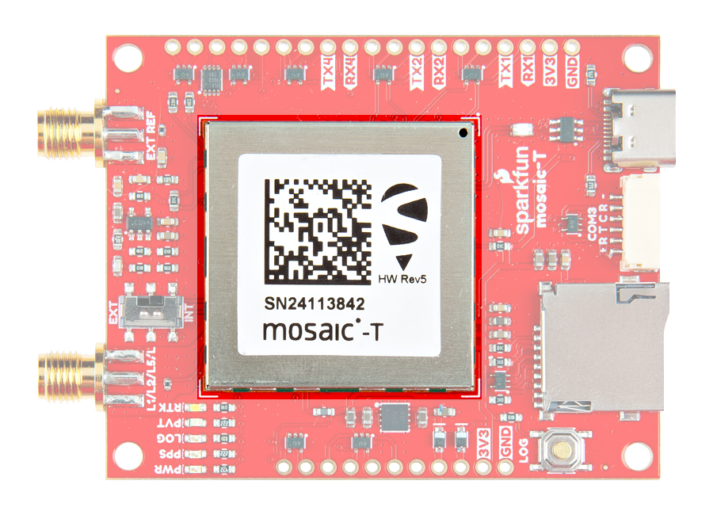

!!! warning
	Users need a compatible L-band GNSS antenna to access the Fugro AtomiChron^&reg;^ service.

Fugro AtomiChron^&reg;^ is a global, real-time, precise clock synchronization and authentication service based on GNSS, for applications that require resilient, accurate and reliable time and frequency. This innovative technology eliminates time drift caused by clocks counting time at slightly different rates and gives users access to extreme frequency stability as well as extreme accurate time references, with levels that surpass high-calibre industrial standard caesium clocks and approaching hydrogen maser performance. Additionally, the service is disseminated through geostationary communication satellites with an over-the-air activation.

<figure markdown>
[{ width="600" }](./assets/img/hookup_guide/block_diagram.png "Click to enlarge")
<figcaption markdown>Fugro AtomiChron overview.</figcaption>
</figure>

**Specifications**

---

- Timing accuracy: <5 ns UTC (95% of the time)
- Accuracy: <1 ns to Fugro AtomiChron^&reg;^ timescale (independent of world-wide location)
- Performance improvement: >10x better than existing high-end GNSS receivers
- Navigation Message Authentication (NMA) status: per satellite status for all 4 GNSS constellations concurrently

## Subscription Sign-Up

The AtomiChron^&reg;^ subscriptions are managed by Fugro. To subscribe, Fugro will need to know the serial number of the mosaic-T module, which is listed on the sticker of the module. If this is worn out, there are other methods to determine this information; such as accessing the internal web server.

<figure markdown>
[{ width="400" }](./assets/img/hookup_guide/mosaic-T.png "Click to enlarge")
<figcaption markdown>Serial Number listed on the mosaic-T module.</figcaption>
</figure>

<figure markdown>
[{ width="400" }](./assets/img/hookup_guidefugro/serial_number.png "Click to enlarge")
<figcaption markdown>Fugro AtomiChron ID on the mosaic-T web page.</figcaption>
</figure>

!!! tip "Spoofing"
	With the precise time service, the receiver computes a precise value (sub-nanosecond precision) of its clock bias with respect to the AtomiChron® time scale. The clock bias is reported in the `PVTCartesian` and `PVTGeodetic` SBF blocks, with the `TimeSystem` field set to *Fugro AtomiChron*. Clock biases computed using only satellites from individual constellations are reported in the `FugroTimeOffset` SBF block. A significant inter-constellation offset may hint at a spoofing attempt.

	With the navigation-message authentication (NMA) service, the receiver detects satellites transmitting non-genuine navigation data, and excludes them from the position and time computation. The status of the AtomiChron® authentication is reported in the FugroAuthStatus SBF block. A global NMA-authenticity flag is available in the the RFStatus SBF block.

!!! note "Clock Bias"

	

	

	**Active Subscription**

	---

	With an AtomiChron^&reg;^ subscription, the firmware will use Fugro's composite bias reported in **FugroTimeOffset** to discipline the internal/external oscillator's frequency. Users also have the option to select a clock bias of individual GNSS constellations over Fugro's composite bias.

	<figure markdown>
	[{ width="400" }](./assets/img/hookup_guide/service-active.png "Click to enlarge")
	<figcaption markdown>The mosaic-T with an active Fugro AtomiChron subscription.</figcaption>
	</figure>

	

	

	**Expired Subscription**

	---

	Without an AtomiChron^&reg;^ subscription, the firmware will use the composite GNSS **RxClkBias** from **PVTGeodetic** to discipline the internal/external oscillator's frequency.

	<figure markdown>
	[{ width="400" }](./assets/img/hookup_guide/service-expired.png "Click to enlarge")
	<figcaption markdown>By default, the Fugro AtomiChron subscription shows as "expired".</figcaption>
	</figure>

	

	

