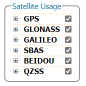

## Supported GNSS Signals
The mosaic-T module is capable of receiving most of the GNSS signals from the various frequency bands of each constellation. By default, the module is only configured to utilize signals (marked in green, in the table below) from specific satellites and frequency bands. Whereas, the signals marked in grey are also supported by the module, but each signal needs to be enabled before they can be integrated into the computed Position-Velocity-Time (PVT) solution or RTK correction data. Meanwhile, any ~~signals colored in red and struck out~~ are not supported by the mosaic-T module; likely due to their proprietary nature, existence outside the module's frequency range, or are experimental/recently implemented.

<table border="1">

<tr>
	<th align="center" rowspan="2" colspan="2" style="min-width: 3rem;"></th>
	<th align="center" colspan="14">Frequency Band</th>
</tr>

<tr>
	<th align="center">L5/E5</th>
	<th align="center" colspan="6">L2</th>
	<th align="center" colspan="2">L6/E6</th>
	<th align="center" colspan="4">L1/E1</th>
	<th align="center">S</th>
</tr>

<tr>
	<th rowspan="7" class="rotate-cell" style="min-width: 3rem;">
		
GNSS Constellation

	</th>
	<th align="center">GPS</th>
	<td align="center" style="background-color:var(--md-default-fg-color--lighter);">L5</td>
	<td align="center" style="background-color:green;color:white;" colspan="2">L2PY</td>
	<td align="center" style="background-color:green;color:white;" colspan="2">L2C</td>
	<td align="center" style="color:red;" colspan="2"><s>L2M</s></td>
	<td align="center" colspan="2"></td>
	<td align="center" style="background-color:green;color:white;">L1CA</td>
	<td align="center" style="background-color:green;color:white;">L1PY</td>
	<td align="center" style="color:red;"><s>L1M</s></td>
	<td align="center" style="color:red;"><s>L1C</s></td>
	<td align="center"></td>
</tr>

<tr>
	<th align="center">GLONASS</th>
	<td align="center"></td>
	<td align="center" style="background-color:var(--md-default-fg-color--lighter);" colspan="2">L3</td>
	<td align="center" style="background-color:green;color:white;" colspan="2">L2P</td>
	<td align="center" style="background-color:green;color:white;" colspan="2">L2CA</td>
	<td align="center" colspan="2"></td>
	<td align="center" style="background-color:green;color:white;" colspan="2">L1CA</td>
	<td align="center" style="color:red;" colspan="2"><s>L1P</s></td>
	<td align="center"></td>
</tr>

<tr>
	<th align="center">Galileo</th>
	<td align="center" style="background-color:green;color:white;">E5a</td>
	<td align="center" style="background-color:green;color:white;" colspan="6">E5b</td>
	<td align="center" style="background-color:var(--md-default-fg-color--lighter);">E6BC</td>
	<td align="center" style="color:red;"><s>E6PRS</s></td>
	<td align="center" style="background-color:green;color:white;" colspan="2">E1BC</td>
	<td align="center" style="color:red;" colspan="2"><s>E1PRS</s></td>
	<td align="center"></td>
</tr>

<tr>
	<th align="center">BeiDou</th>
	<td align="center" style="background-color:var(--md-default-fg-color--lighter);">B2a</td>
	<td align="center" style="background-color:var(--md-default-fg-color--lighter);" colspan="3">B2b</td>
	<td align="center" style="background-color:green;color:white;" colspan="3">B2I</td>
	<td align="center" style="background-color:green;color:white;" colspan="2">B3I</td>
	<td align="center" style="background-color:green;color:white;" colspan="2">B1I</td>
	<td align="center" style="background-color:var(--md-default-fg-color--lighter);" colspan="2">B1C</td>
	<td align="center"></td>
</tr>

<tr>
	<th align="center">SBAS</th>
	<td align="center" style="background-color:green;color:white;">L5</td>
	<td align="center" colspan="6"></td>
	<td align="center" colspan="2"></td>
	<td align="center" style="background-color:green;color:white;" colspan="4">L1</td>
	<td align="center"></td>
</tr>

<tr>
	<th align="center">QZSS</th>
	<td align="center" style="background-color:var(--md-default-fg-color--lighter);">L5</td>
	<td align="center" style="background-color:green;color:white;" colspan="6">L2C</td>
	<td align="center" style="color:red;"><s>L6E/LEX</s></td>
	<td align="center" style="color:red;"><s>L6D</s></td>
	<td align="center" style="background-color:green;color:white;">L1CA</td>
	<td align="center" style="background-color:green;color:white;">L1C</td>
	<td align="center" style="color:red;"><s>L1S/SAIF</s></td>
	<td align="center" style="color:red;"><s>L1Sb</s></td>
	<td align="center" style="color:red;"><s>S</s></td>
</tr>

<tr>
	<th align="center">NavIC</th>
	<td align="center" style="background-color:var(--md-default-fg-color--lighter);">L5</td>
	<td align="center" colspan="6"></td>
	<td align="center" colspan="2"></td>
	<td align="center" colspan="4"></td>
	<td align="center" style="color:red;"><s>S</s></td>
</tr>

</table>

!!! info "Legend for GNSS Signals"
	- Supported; Enabled by default
	- Supported; Not enabled by default
	- ~~**Not supported**~~

## Enable Additional Signals
Below, are instructions to configure the mosaic-T module to track any of the supported GNSS signals. Additionally, users can also configure whether the signals are utilized in the Position-Velocity-Time (PVT) computations or their navigation data is accessed.

!!! warning "Enabling the GPS-L5 Signal"
	For users interested in the GPS-L5 signal, extra configuration steps are required to utilize this signal for evaluation and testing purposes.

	=== "Web Interface"
		From the **Admin** tab, click on **Expert Control** from the drop-down menu. Then, navigate through the **Control Panel** > **Navigation** > **Receiver Operation** > **Masks** menus to find the `Discard unhealthy satellites` setting. Set both the **Tracking** and **PVT** options to `off`, from their drop-down menus.

		<figure markdown>
		[{ width="400" }](./assets/img/hookup_guide/gnss_signals/health_masks-off.png "Click to enlarge")
		<figcaption markdown>
		Enabling the tracking and PVT use of satellites (and their signals), which would be considered "unhealthy".
		</figcaption>
		</figure>

		!!! tip
			Make sure to click the ++"OK"++ button at the bottom of each page, where you are making changes to update the current configuration. Also, don’t forget to save it to boot, if you want the configuration to persist when you cycle power.

	=== "Command Interface"
		- **`setHealthMask, Tracking, off`**
		- **`setHealthMask, PVT, off`**

	??? info "Health Status"
		Currently, the L5 frequency band from the GPS constellation is pre-operational until a sufficient monitoring capability is established. Therefore, the satellites broadcast an *"unhealthy"* operational status in their L5 signals and prevent its utilization in PVT computations.

### Web Interface
Through the web interface, users will need to access the advanced settings of the configuration menu by clicking on the **Expert Control** option from the **Admin** tab's drop-down menu. Clicking on this will prompt a security dialog box to pop up, click the ++"Proceed"++ button to make changes to these settings. Then, navigate through the **Control Panel** > **Navigation** > **Advance User Settings** menus.

<article class="grid cards" markdown>

-   #### Signal Tracking

	---

	From the **Advance User Settings** menu, navigate through the **Tracking** > **Signal Tracking** menus. Within this configuration setting, users can enable or disable the tracking of the specific GNSS signals from each constellation.

	<figure markdown>
	
	<figcaption markdown>
	Enabling the tracking of all the signals from all the GNSS constellations.
	</figcaption>
	</figure>

-   #### Signal Utilization

	---

	From the **Advance User Settings** menu, navigate through the **PVT** > **Signal Usage** menus. Within these configuration settings, users can enable or disable if specific GNSS signals are utilized in PVT computations or for navigation data.

	<figure markdown>
	
	<figcaption markdown>
	Enabling the utilization of all the GNSS signals for PVT computations and navigational data outputs.
	</figcaption>
	</figure>

</article>

!!! tip
	Make sure to click the ++"OK"++ button at the bottom of each page, where you are making changes to update the current configuration. Also, don’t forget to save it to boot, if you want the configuration to persist when you cycle power.

### Command Interface

=== "Signal Tracking"
	- **Enable Trackings of Specific Signals:** `setSignalTracking, <list signals>`
		- **Example:**`setSignalTracking, GPSL1CA+GPSL1PY+GPSL2PY+GPSL2C+GPSL5+...`
	- **Enable Trackings of All Signals:**`setSignalTracking,all`

=== "Signal Usage"
	- **Enable Use of Specific Signals:** `setSignalUsage, <list signals - PVT>, <list signals - NavData>`
		- **Example:**`setSignalUsage, GPSL1CA+GPSL1PY+GPSL2PY+GPSL2C+GPSL5..., GPSL1CA+GPSL1PY+GPSL2PY+GPSL2C+GPSL5...`
	- **Enable Use of All Signals:**`setSignalUsage, all, all`

## Enable Additional Satellites
Below, are instructions to configure the mosaic-T module to utilize additional GNSS satellites that weren't enabled by default. A satellite's tracking and usage must be enabled before their signals can be tracked or utilized.

### Web Interface
Through the web interface, users will need to access the advanced settings of the configuration menu by clicking on the **Expert Control** option from the **Admin** tab's drop-down menu. Clicking on this will prompt a security dialog box to pop up, click the ++"Proceed"++ button to make changes to these settings. Then, navigate through the **Control Panel** > **Navigation** > **Advance User Settings** menus.

-   #### Satellite Tracking

	---

	From the **Advance User Settings** menu, navigate through the **Tracking** > **Satellite Tracking** menus. There, users can enable or disable the tracking of individual GNSS satellites from each constellation.

	<figure markdown>
	
	<figcaption markdown>
	Enabling the tracking of all satellites from every GNSS constellations.
	</figcaption>
	</figure>

-   #### Satellite Utilization

	---

	From the **Advance User Settings** menu, navigate through the **PVT** > **Satellite Usage** menus. There, users can enable or disable the utilization of individual GNSS satellites from each constellation.

	<figure markdown>
	
	<figcaption markdown>
	Enabling the utilization of all the satellites from every GNSS constellation.
	</figcaption>
	</figure>

!!! tip
	Make sure to click the ++"OK"++ button at the bottom of each page, where you are making changes to update the current configuration. Also, don’t forget to save it to boot, if you want the configuration to persist when you cycle power.

### Command Interface

=== "Satellite Tracking"
	- **Enable Tracking of Specific Satellites:** `setSatelliteTracking, <list satellites>`
		- **Example:** `setSatelliteTracking, G01+G02+G03+G04+...`
	- **Enable Tracking of All Satellites:** `setSatelliteTracking,all`

=== "Satellite Usage"
	- **Enable Use of Specific Satellites:** `setSatelliteUsage, <list satellites>`
		- **Example:** `setSatelliteUsage, G01+G02+G03+G04+...`
	- **Enable Use of All Satellites:** `setSatelliteUsage, all`
