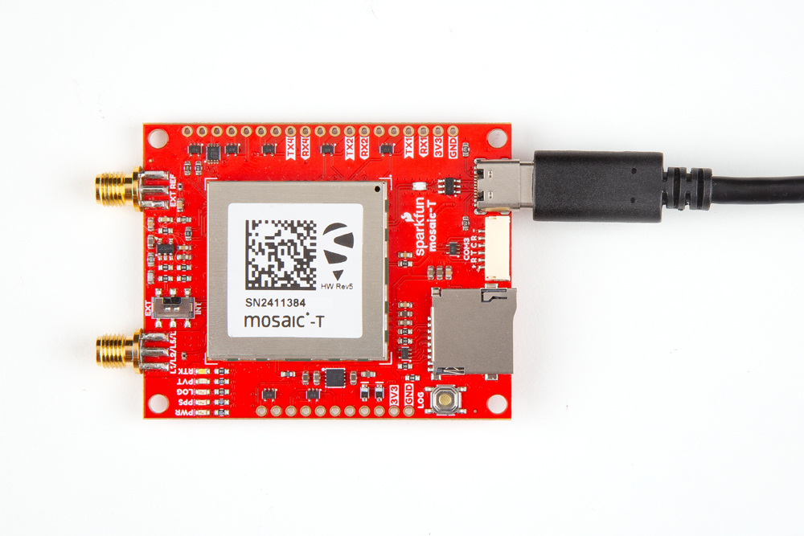
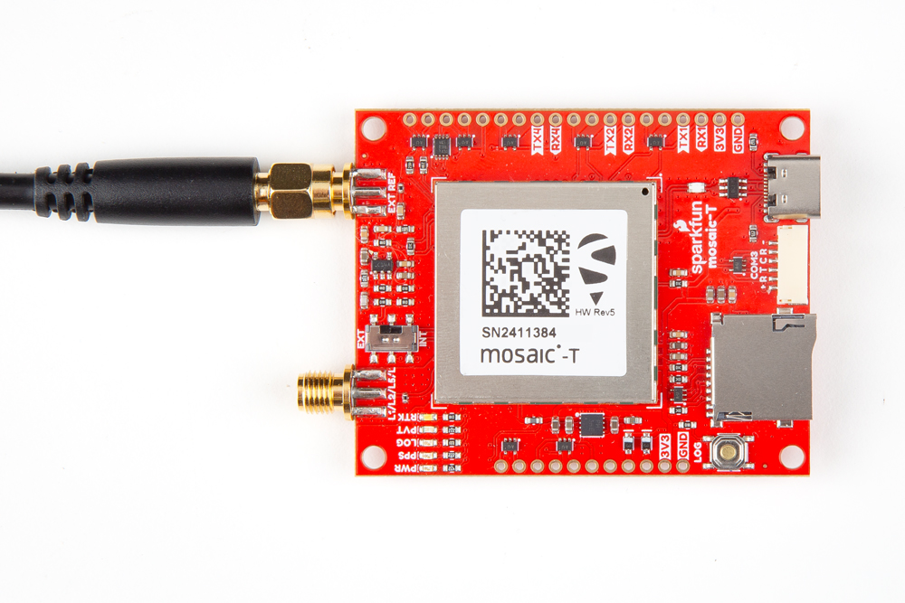
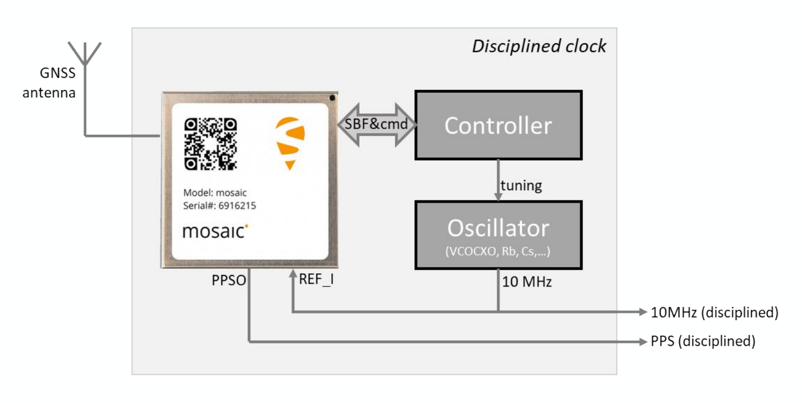

!!! danger "Important: Read Before Use!"
	!!! warning "ESD Sensitivity"
		The mosaic-T module is sensitive to [ESD](https://en.wikipedia.org/wiki/Electrostatic_discharge "Electrostatic Discharge"). Use a proper grounding system to make sure that the working surface and the components are at the same electric potential.

		??? info "ESD Precaution"
			As recommended by the manufacturer, we highly recommend that users take the necessary ESD precautions to avoid damaging their module.

			

			

			<article class="video-500px" style="text-align: center; margin: auto;" markdown>
			<iframe src="https://www.youtube.com/embed/hrL5J6Q5gX8?si=jOPBat8rzMnL7Uz4&amp;start=26;&amp;end=35;" title="Septentrio: Getting Started Video (playback starts at ESD warning)" frameborder="0" allow="accelerometer; autoplay; clipboard-write; encrypted-media; gyroscope; picture-in-picture" allowfullscreen></iframe>
			</article>

			

			-   <a href="https://www.sparkfun.com/ifixit-anti-static-wrist-strap.html">
				<figure markdown>
				
				</figure>

				---

				**iFixit Anti-Static Wrist Strap** 
				TOL-25572</a>

			

	!!! warning "Active Antenna"
		Never inject an external DC voltage into the SMA connector for the GNSS antenna, as it may damage the mosaic-T module. For instance, when using a splitter to distribute the antenna signal to several GNSS receivers, make sure that no more than one output of the splitter passes DC. Use [DC-blocks](https://en.wikipedia.org/wiki/DC_block) otherwise.

	!!! warning "External Reference Clock"
		If the switch for an external reference clock is enabled, users must provide a 10MHz input signal. Otherwise, the mosaic-T module will cease to operate, without a clock signal.

## USB Programming
The USB connection is utilized for configuration and serial communication. Users only need to plug their mosaic-T Timing GNSS breakout board into a computer using a USB-C cable.

<figure markdown>
[{ width="400" }](./assets/img/hookup_guide/assembly-usb.jpg "Click to enlarge")
<figcaption markdown>The mosaic-T Timing GNSS breakout board with a USB-C cable attached.</figcaption>
</figure>

1. When the board is initially connected to a computer, the module will initialize as a USB mass storage device.
	- For Windows PCs, the [USB driver](software_overview.md#septentrio-usb-driver) can be installed from the mass storage device or the [RxTools software suite](software_overview.md#rxtools-software-suite).
	- When the SD card is mounted, this drive will contain the contents of the SD card that is inserted on the board.
1. Once the USB driver is installed:
	- Two virtual `COM` ports are emulated, which can be used as standard serial interfaces to access the receiver.
	- This interface also supports Ethernet-over-USB and the internal web server can be accessed `192.168.3.1`.

## GNSS Antenna
In order to receive [GNSS](https://en.wikipedia.org/wiki/Satellite_navigation "Global Navigation Satellite System") signals, users will need to connect a compatible antenna.

<figure markdown>
[{ width="400" }](./assets/img/hookup_guide/assembly-antenna.jpg "Click to enlarge")
<figcaption markdown>Attaching a GNSS antenna to the SMA connector on the mosaic-T Timing GNSS breakout board.</figcaption>
</figure>

!!! tip
	For the best performance, we recommend users choose a compatible L1/L2/L5/L-band GNSS antenna and utilize a low-loss cable. Also, don't forget that GNSS signals are fairly weak and can't penetrate buildings or dense vegetation. The GNSS antenna should have an unobstructed view of the sky.

!!! danger
	Never inject an external DC voltage into the SMA connector for the GNSS antenna, as it may damage the mosaic-T module. For instance, when using a splitter to distribute the antenna signal to several GNSS receivers, make sure that no more than one output of the splitter passes DC. Use [DC-blocks](https://en.wikipedia.org/wiki/DC_block) otherwise.

## SD Card
An &micro;SD card slot is available for users to log and store data, locally on the board. Users, will need to insert a compatible SD card and configure the mosaic-T module for data logging.

<figure markdown>
[{ width="400" }](./assets/img/hookup_guide/assembly-sd_card.jpg "Click to enlarge")
<figcaption markdown>Inserting an SD card into the mosaic-T Timing GNSS breakout board.</figcaption>
</figure>

!!! info "SD Card Specifications"
	The mosaic-T module is only compatible with SD cards of up to 32GB, formatted with a `FAT32` file system.

!!! success "Initial Configuration"
	Before data logging can occur, it is necessary to create a *logging stream* from the **Logging** tab of the web interface or using the **RxTools** software suite. Streams can contain NMEA or SBF (Septentrio Binary Format) data; SBF can contain RTCM and/or RINEX. *(see the [Data Logging](web_interface.md#data-logging) section)*

!!! info "Operation"
	Data logging can be controlled on the board through either the [++"LOG"++ button](#log-button) or [`LOG BTN` pin](#data-logging).

	- Pressing the button or pin `LOW` *(< 5s)* toggles data logging to the SD card on and off.
	- Holding the button or pin `LOW` for more than 5 seconds *(> 5s)* and then releasing it, will force the board to:
		- Unmount the SD card if it was mounted
		- Mount the SD card if it was unmounted

	!!! question "Status"
		The status of the SD card and data stream are indicated on the `LOG` LED and pin.

		<article style="text-align: center;" markdown>

		| LED      | Pin    | Status                           |
		|:-------: | :----: | :------------------------------- |
		| Off      | Low    | SD card not present or unmounted |
		| On       | High   | SD card present and mounted      |
		| Blinking | Pulses | Data logging activity            |

		</article>

!!! warning "Standby Mode"
	When Standby mode is initialized, the module terminates all running processes and unmounts the external SD card to avoid any log file corruption *(see the **[Power Modes](#power-modes)** section)*.

## JST Connector
The JST connector on the Tri-band GNSS RTK board, breaks out the `COM3` UART port of the mosaic-T module.

<figure markdown>
[{ width="400" }](./assets/img/hookup_guide/assembly-jst_connector.jpg "Click to enlarge")
<figcaption markdown>Connecting a cable to the JST connector of the mosaic-T Timing GNSS breakout board.</figcaption>
</figure>

!!! warning "Pin Connections"
	When connecting the mosaic-T Timing GNSS breakout board to another device through the JST connector, users need to be aware of the pin connections and voltage ranges of the products. Below, is a diagram of the pin connections for the 6-pin JST GH connector and a table of the connections for our radio transceivers that users can reference.

	

	

	<figure markdown>
	[{ width="400" }](./assets/img/hookup_guide/jst_pinout.png "Click to enlarge")
	<figcaption markdown>The pin connections of the JST connector on the mosaic-T Timing GNSS breakout board.</figcaption>
	</figure>

	

	<article style="text-align: center;" markdown>

	<table border="1" markdown>
	<tr>
	<th style="vertical-align:middle;">Pin Number</th>
	<td align="center">
		**1** 
		*(Left Side)*
	</td>
	<td align="center">**2**</td>
	<td align="center">**3**</td>
	<td align="center">**4**</td>
	<td align="center">**5**</td>
	<td align="center">
		**6** 
		*(Right)*
	</td>
	</tr>
	<tr>
	<th style="vertical-align:middle;">Label</th>
	<td>
		V - Triband 
		5V - Radios
	</td>
	<td>
		RX - Triband/SiK 
		RXI - LoRaSerial
	</td>
	<td>
		TX - Triband/SiK 
		TXO - LoRaSerial
	</td>
	<td>
		C - Triband 
		CTS - Radios
	</td>
	<td>
		R - Triband 
		RTS - Radios
	</td>
	<td>
		G - Triband 
		GND - Radios
	</td>
	</tr>
	<tr>
	<th style="vertical-align:middle;">Function</th>
	<td>
		**Voltage Input** 
		- Triband: 3.5 to 5.5V 
		- SiK: 5V 
		- LoRaSerial: 3.3 to 5V
	</td>
	<td align="center" style="vertical-align:middle;">UART - Receive</td>
	<td align="center" style="vertical-align:middle;">UART - Transmit</td>
	<td align="center" style="vertical-align:middle;">
		Flow Control 
		*Clear-to-Send*
	</td>
	<td align="center" style="vertical-align:middle;">
		Flow Control 
		*Ready-to-Send*
	</td>
	<td align="center" style="vertical-align:middle;">Ground</td>
	</tr>
	</table>

	</article>

	

## Breakout Pins
The [PTH](https://en.wikipedia.org/wiki/Through-hole_technology "Plated Through Holes") pins on the Tri-band GNSS RTK board are broken out into 0.1"-spaced pins on the outer edges of the board.

??? note "New to soldering?"
	If you have never soldered before or need a quick refresher, check out our [How to Solder: Through-Hole Soldering](https://learn.sparkfun.com/tutorials/how-to-solder-through-hole-soldering) guide.

	

	-   <a href="https://learn.sparkfun.com/tutorials/5">
		<figure markdown>
		
		</figure>

		---
		
		**How to Solder: Through-Hole Soldering**</a>

	

**Headers**

---

When selecting headers, be sure you are aware of the functionality you require.

<figure markdown>
[{ width="400" }](./assets/img/hookup_guide/assembly-headers.jpg "Click to enlarge")
<figcaption markdown>Soldering headers to the mosaic-T Timing GNSS breakout board.</figcaption>
</figure>

**Hookup Wires**

---

For a more permanent connection, users can solder wires directly to the board.

<figure markdown>
[{ width="400" }](./assets/img/hookup_guide/assembly-wires.jpg "Click to enlarge")
<figcaption markdown>Soldering wires to the mosaic-T Timing GNSS breakout board.</figcaption>
</figure>

## External Oscillator
In order to create a [GNSS disciplined oscillator](https://en.wikipedia.org/wiki/GPS_disciplined_oscillator), the mosaic-T module needs a 50&ohm;, 10MHz sinusoidal signal from tunable oscillator and a microcontroller to fine-tune the adjustments.

!!! warning
	When the switch controlling the source of the reference clock is set to `EXT`, users must provide a 10MHz input signal. Otherwise, the mosaic-T module will cease to operate, without the clock signal. Additionally, the module should be powered off when switching between frequency reference sources; or the module will need to be reset after.

<figure markdown>
[{ width="400" }](./assets/img/hookup_guide/assembly-external_clock.jpg "Click to enlarge")
<figcaption markdown>Connecting an external reference clock to the mosaic-T Timing GNSS breakout board.</figcaption>
</figure>

!!! info
	To [convert the external reference clock into disciplined oscillator](oscillator.md), users will also need a controller to:

	- Read the clock bias from the mosaic-T module's SBF messages
	- Adjust the frequency of the external clock signal

	Unlike traditional approaches, this configuration does not require any external hardware to measure the time delay. Once the clock bias reaches zero, the oscillator's time scale will be aligned with the GNSS time. For time synchronization applications, users can also implement a [third-party synchronization service](fugro_atomichron.md) in the mosaic-T module's configuration. This will allow all systems to not only be aligned with the GNSS time, but also synchronized together.

	<figure markdown>
	[{ width="300" }](./assets/img/hookup_guide/disciplined_clock.png "Click to enlarge")
	<figcaption markdown>The setup for a disciplined clock with a mosaic-T module, controller, and a tunable oscillator.</figcaption>
	</figure>

