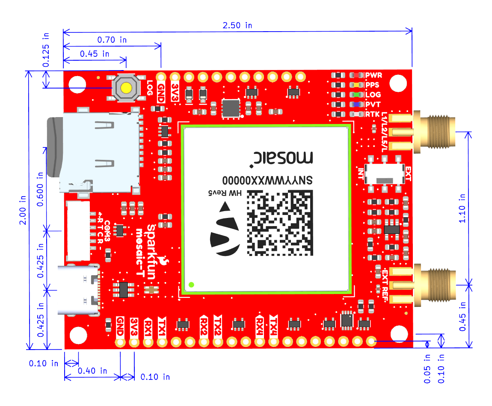
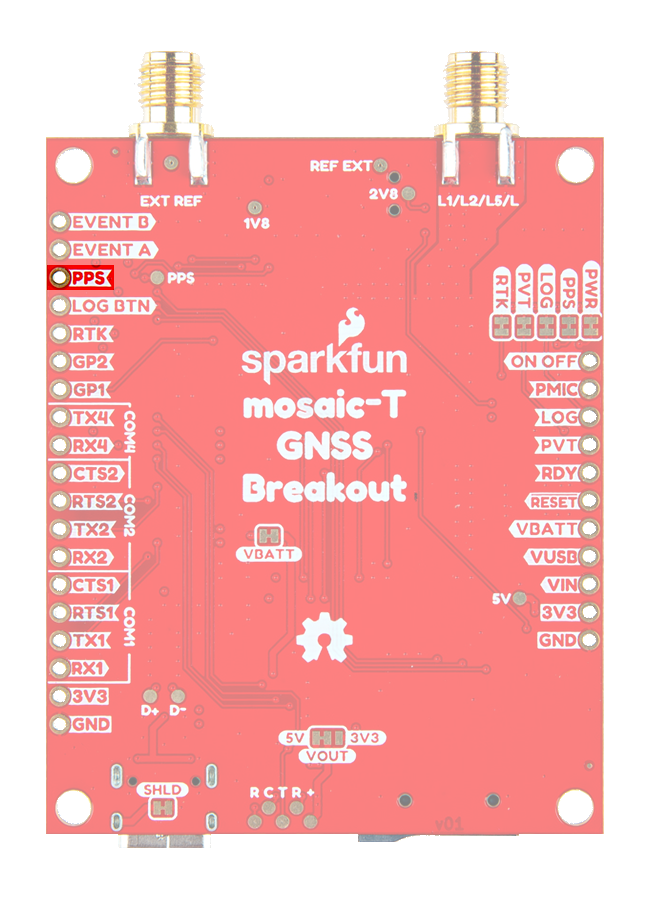
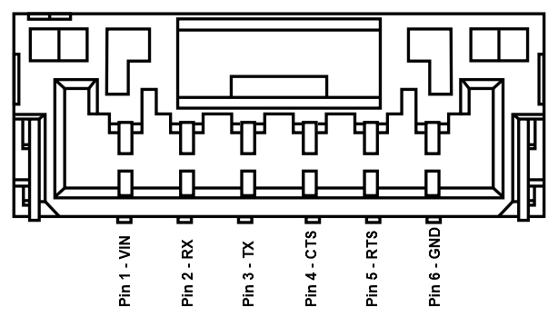

!!! danger "Important: Read Before Use!"
	!!! warning "ESD Sensitivity"
		The mosaic-T module is sensitive to [ESD](https://en.wikipedia.org/wiki/Electrostatic_discharge "Electrostatic Discharge"). Use a proper grounding system to make sure that the working surface and the components are at the same electric potential.

		??? info "ESD Precaution"
			As recommended by the manufacturer, we highly recommend that users take the necessary ESD precautions to avoid damaging their module.

			

			

			<article class="video-500px" style="text-align: center; margin: auto;" markdown>
			<iframe src="https://www.youtube.com/embed/hrL5J6Q5gX8?si=jOPBat8rzMnL7Uz4&amp;start=26;&amp;end=35;" title="Septentrio: Getting Started Video (playback starts at ESD warning)" frameborder="0" allow="accelerometer; autoplay; clipboard-write; encrypted-media; gyroscope; picture-in-picture" allowfullscreen></iframe>
			</article>

			

			-   <a href="https://www.sparkfun.com/ifixit-anti-static-wrist-strap.html">
				<figure markdown>
				
				</figure>

				---

				**iFixit Anti-Static Wrist Strap** 
				TOL-25572</a>

			

	!!! warning "Active Antenna"
		Never inject an external DC voltage into the SMA connector for the GNSS antenna, as it may damage the mosaic-T module. For instance, when using a splitter to distribute the antenna signal to several GNSS receivers, make sure that no more than one output of the splitter passes DC. Use [DC-blocks](https://en.wikipedia.org/wiki/DC_block) otherwise.

	!!! warning "External Reference Clock"
		If the switch for an external reference clock is enabled, users must provide a 10MHz input signal. Otherwise, the mosaic-T module will cease to operate, without a clock signal.

## :material-folder-cog: Design Files

<!-- Import the component -->

-   :kicad-primary:{ .enlarge-logo } Design Files

	---

	- :fontawesome-solid-file-pdf: [Schematic](./assets/board_files/schematic.pdf)
	- :material-folder-zip: [KiCad Files](./assets/board_files/kicad_files.zip)
	- :material-rotate-3d: [STEP File](./assets/3d_model/cad_model.step)
	- :fontawesome-solid-file-pdf: [Board Dimensions](./assets/board_files/dimensions.pdf):
		- 2.50" x 2.00" (635mm x 508mm)

-   <!-- Boxes in tabs -->

	=== "3D Model"
		<article style="text-align: center;" markdown>
		<model-viewer src="../assets/3d_model/web_model.glb" camera-controls poster="../assets/3d_model/poster.png" tone-mapping="neutral" shadow-intensity="2" shadow-softness="0.2" camera-orbit="0deg 75deg 0.103m" field-of-view="25.11deg" style="width: 100%; height: 450px;">
		</model-viewer>

		[Download the `*.step` File](./assets/3d_model/cad_model.step "Click download"){ .md-button .md-button--primary width="250px" }

		</article>

		???+ tip "Manipulate 3D Model"
			<article style="text-align: center;" markdown>

			| Controls       | Mouse                    | Touchscreen    |
			| :------------- | :----------------------: | :------------: |
			| Zoom           | Scroll Wheel             | 2-Finger Pinch |
			| Rotate         | ++"Left-Click"++ & Drag  | 1-Finger Drag  |
			| Move/Translate | ++"Right-Click"++ & Drag | 2-Finger Drag  |

			</article>

	=== "Dimensions"
		<article style="text-align: center;" markdown>
		[{ width="450" }](./assets/board_files/dimensions.png "Click to enlarge")
		<figcaption markdown>Dimensions of the mosaic-T Timing GNSS breakout board.</figcaption>
		</article>

		???+ tip "Need more measurements?"
			For more information about the board's dimensions, users can download the [KiCad files](./assets/board_files/kicad_files.zip) for this board. These files can be opened in KiCad and additional measurements can be made with the measuring tool.

			!!! info ":octicons-download-16:{ .heart } KiCad - Free Download!"
				KiCad is free, open-source [CAD]("computer-aided design") program for electronics. Click on the button below to download their software. *(\*Users can find out more information about KiCad from their [website](https://www.kicad.org/).)*

				<article style="text-align: center;" markdown>
				[Download :kicad-primary:{ .enlarge-logo }](https://www.kicad.org/download/ "Go to downloads page"){ .md-button .md-button--primary width="250px" }
				</article>

	
			???+ info ":straight_ruler: Measuring Tool"
				This video demonstrates how to utilize the dimensions tool in KiCad, to include additional measurements:

				<article class="video-500px" style="text-align: center; margin: auto;" markdown>
				<iframe src="https://www.youtube.com/embed/-eXuD8pkCYw" title="KiCad Dimension Tool" frameborder="0" allow="accelerometer; autoplay; clipboard-write; encrypted-media; gyroscope; picture-in-picture" allowfullscreen></iframe>
				{ .qr }
				</article>

## Board Layout
The SparkFun Timing GNSS Breakout - mosaic-T features the following:

<figure markdown>
[{ width="750" }](./assets/img/hookup_guide/layout.png "Click to enlarge")
<figcaption markdown>Layout of the major components on the breakout board.</figcaption>
</figure>

1. **USB-C Connector**
:   The primary inteface for powering and interacting with the board
1. **6-Pin JST Connector**
:   A UART interface for the mosaic-T GNSS module
1. **&micro;SD Card Slot**
:   An SD card slot for data logging
1. **`LOG` Button**
:   A button to mount the SD card and intialize the data logging stream
1. **mosaic-T GNSS Module**
:	The Septentrio mosaic-T GNSS module
1. **Status LEDs**
:   LED status indicators for the mosaic-T GNSS module
1. **SMA Connectors**
	- `L1/L2/L5/L`: The input for a GNSS antenna
	- `EXT REF`: The input for an external reference clock signal
1. **`INT`/`EXT` Switch**
:   Used to switch between an internal or external refernce clock signal for the mosaic-T GNSS module. If switched to `EXT`, an external 10MHz signal must be provided for the GNSS module to function

## USB-C Connector
A USB connector is provided to power and interface with the mosaic-T GNSS receiver. For most users, it will be the primary method for communicating with the mosaic-T module.

<figure markdown>
[{ width="400" }](./assets/img/hookup_guide/usb_connector.png "Click to enlarge")
<figcaption markdown>USB-C connector on the mosaic-T Timing GNSS breakout board.</figcaption>
</figure>

!!! serial "Windows OS"
	For Windows computers, users will need to [install the USB driver](software_overview.md#usb-driver) before they can interact with the mosaic-T GNNS module.

!!! info
	For more details about this interface, please refer to the [**USB-C Connector** section](#usb-c-connector_1) below.

## Power
The simplest method to power the board is through the USB-C connector. However, the mosaic-T Timing GNSS breakout board only requires **3.3V** to power most of its components(1), which can be supplied though JST connector or [PTH](https://en.wikipedia.org/wiki/Through-hole_technology "Plated Through Holes") pins.
{ .annotate }

1. 5V is only required to utilize the USB interface; and when enabled, it can also power the JST connector.

<figure markdown>
[{ width="400" }](./assets/img/hookup_guide/power_connections.png "Click to enlarge")
<figcaption markdown>mosaic-T Timing GNSS breakout board's power connections.</figcaption>
</figure>

Below, is a general summary of the power circuitry on the board, broken out as [PTH](https://en.wikipedia.org/wiki/Through-hole_technology "Plated Through Holes") pins:

- **`VUSB`** - The voltage from the USB-C connector, usually **5V**.
	- Input Voltage Range: 2.2 - 5.5 V
	- Power source for the entire board.
		- Powers the 3.3V voltage regulator (AP7361C) and when enabled, it can also power the JST connector. (1)
		- This pin powers the integrated PHY of the mosaic-T module's USB interface.
- **`VIN`** - Alternate input supply voltage for the board.
	- Input Voltage Range: 2.2 - 6 V
	- Alternative power supply input for the board, excluding the integrated PHY of the USB interface.
		- Powers the 3.3V voltage regulator (AP7361C) and when enabled, it can also power the JST connector. (2)
- **`3V3`** - Provides a regulated 3.3V from [AP7361C](./assets/component_documentation/AP7361C.pdf) using the power from the `VIN` or `VUSB` (5V) inputs.
	- Input Voltage Range: 3.135 - 3.465 V
	- The **3.3V** AP7361C LDO regulator can source up to 1A.
		- Used to power the mosaic-T module, SD card slot, power LED, and the active antenna preamplifier for the mosaic-T module.
- **`VBATT`** - *Always-on* power supply
	- Input Voltage Range: 3.135 - 3.465 V
	- Tied to `3.3V` *(see the **[Jumpers](#jumpers)** section)*.
		- Used to power the module in **Standby** mode.
- **`GND`** - The common ground or the 0V reference for the voltage supplies.

1. While the [AP7361C](./assets/component_documentation/AP7361C.pdf) LDO regulator has an input voltage range of 2.2 - 6V, users should supply:
	- A minimum of **3.5V** for a 3.3V output from the regulator
	- A maximum of **5.5V** as not to exceed the electrical limitations of the mosaic-T module
1. While the [AP7361C](./assets/component_documentation/AP7361C.pdf) LDO regulator has an input voltage range of 2.2 - 6V, a minimum supply voltage of **3.5V** is recommended for a 3.3V output.

!!! tip "JST Connector"
	The `V` pin of the JST connector is designed to operate as a voltage output. However, an input voltage can be supplied through the connector, but users should be mindful of any voltage contention issues.

!!! info
	For more details, users can reference the [schematic](./assets/board_files/schematic.pdf) and the datasheets of the individual components on the board.

### Power Modes
The mosaic-T module operates in three different power states, which 

<figure markdown>
[{ width="400" }](./assets/img/hookup_guide/pins-power_mode.png "Click to enlarge")
<figcaption markdown>The power management pins of the mosaic-T Timing GNSS breakout board.</figcaption>
</figure>

- **Off** - The module is completely turned off
	- When transitioning to the **Off** state from **Active**, recent data may not be lost and not logged to the external SD card
- **Standby** - The module is in a low-power consumption mode (1)
	- The module power consumption in standby is <5mW
	- The `PMIC` pin is driven `LOW`
	- The `RDY` pin is in a `LOW`
	- When the `ON OFF` pin is driven `LOW` for at least 50ms, the module toggles between its **Standby** and **Active** states
- **Active** - The module is operating with all functions active
	- On power up, the module restarts in the configuration stored in the boot configuration file
	- The `PMIC` pin is driven `HIGH`
	- The `RDY` pin is in a `HIGH` (2)

1. Essentially, the same state as **Off**; except in the transition to the **Standby** mode, before the module shuts down:
	- All logging tasks are terminated
	- The SD card is unmounted
	- The `PMIC` pin is driven `LOW`
1. Level becomes `HIGH` about 300ms after powering up, reset, or waking up from standby

!!! info
	For more information on the power management of the mosaic-T module, please refer to sections **3.4**, **3.5**, **4.1**, and **4.13** of the [hardware manual](./assets/component_documentation/mosaic_hardware_manual_v1.9.0.pdf).

??? tip "Drive Current"
	The drive current on the `PMIC`, `RDY`, and `ON OFF` pins is minimal. Enough to be read by a digital pin on a microcontroller, but not high enough to drive an LED.

### Power Consumption
The power consumption of the mosaic-T module depends on the GNSS signals enabled and the positioning mode. The table below, lists the average power consumption for common configurations. The current listed, is based on a supply voltage of 3.3V.

<article style="text-align: center;" markdown>

| GNSS Signals | Positioning Mode | Power (mW) | Current (mA) |
| :----------- | :--------------- | :--------: | :----------: |
| GPS L1 C/A | Stand-Alone (1Hz) | 550 | 167 |
| GPS L1/L2 | RTK (1Hz) | 670 | 203 |
| GPS/GLONASS L1/L2 | RTK (1Hz) | 695 | 211 |
| GPS/GLONASS L1/L2+GALILEO L1/E5a +BeiDou B1C/B2a | RTK (1Hz) | 850 | 258 |
| GPS/GLONASS L1/L2+GALILEO L1/E5a +BeiDou B1C/B2a | RTK (100 Hz) | 930 | 282 |
| GPS/GLONASS L1/L2 + L-band | PPP (1Hz) | 760 | 230 |
| All signals from all GNSS constellations | Static (1Hz) | 910 | 276 |
| All signals from all GNSS constellations +L-band | Static(1Hz) | 980 | 297 |
| All signals from all GNSS constellations +L-band | Static (100Hz) | 1080 | 327 |

*Source: [mosaic-T Hardware Manual](./assets/component_documentation/mosaic_hardware_manual_v1.9.0.pdf)*
</article>

## :fontawesome-solid-microchip:&nbsp; mosaic-T
The centerpiece of the mosaic-T Timing GNSS breakout board, is the [mosaic-T module](./assets/component_documentation/mosaic_hardware_manual_v1.9.0.pdf) from [Septentrio](https://www.septentrio.com/en). Their mosaic modules are low-power, multi-band, multi-constellation GNSS receivers capable of delivering centimeter-level precision at high update rates. The modules also feature Septentrio's unique [AIM+ technology](https://www.septentrio.com/en/learn-more/advanced-positioning-technology/aim-resilient-and-secure-gnss/gps-receivers) for interference mitigation and anti-spoofing, which ensures their best-in-class reliability and scalable position accuracy.

<article class="video-500px" style="text-align: center; margin: auto;" markdown>
<iframe src="https://www.youtube.com/embed/Co8hrVeklAA" title="Septentrio: Mosaic - GNSS / GPS module receiver range" frameborder="0" allow="accelerometer; autoplay; clipboard-write; encrypted-media; gyroscope; picture-in-picture" allowfullscreen></iframe>
</article>

!!! warning "RTK Base"
	The mosaic-T is a superb GNSS module designed for highly accurate timing applications. It can be configured as a RTK Rover and will make use of incoming RTCM corrections. **But it can not be configured as a RTK Base. RTCM output is not supported.**

<figure markdown>
[{ width="400" }](./assets/img/hookup_guide/mosaic-T.png "Click to enlarge")
<figcaption markdown>The mosaic-T module on the mosaic-T Timing GNSS breakout board.</figcaption>
</figure>

**Features:**

- Operating Voltage: **3.135 - 3.465V**
- Operating Temperature: -40 - 85&deg;C
- GNSS Support
	- GPS: L1C/A, L1PY, L2C, L2P, L5
	- GLONASS: L1CA, L2CA, L2P, L3 CDMA
	- Beidou: B1I, B1C, B2a, B2b, B2I, B3
	- Galileo: E1, E5a, E5b, E5 AltBoc, E6
	- QZSS: L1C/A, L1 C/B, L2C, L5
	- Navic: L5
	- SBAS: Egnos, WA
- Antenna Specifications
	- Preamplification Range: 15-50dB
	- Bias Voltage: 3.0 - 5.5V
	- 448 Hardware Channels
- Update Rate: 100Hz
- Latency: < 10ms

 

- Time to Fix
	- Cold Start: < 45s
	- Warm: < 20s
	- Reacquisition: 1s
- Timing Precision: 5ns
- Position Accuracy

	<article style="text-align: center;" markdown>

	| Correction | Horizontal                             | Vertical                     |
	| :--------- | :------------------------------------: | :--------------------------: |
	| RTK        | **0.6cm** *(&plusmn;0.5ppm)* ~0.25" | 1cm *(&plusmn;1ppm)* ~.4" |
	| DGNSS      | 40cm ~1.3'                          | 70cm ~2.3'                |
	| SBAS       | 60cm ~2'                            | 80cm ~2.6'                |
	| Standalone | 1.2m ~4'                            | 1.9m ~6.2'                |

	</article>

!!! info
	The mosaic-T has three power modes: **Active**, **Standby**, and **Off** *(see the **[Power Modes](#power-modes)** section)*.

### Frequency Bands
The mosaic modules are multi-band, multi-constellation GNSS receivers. Below, are charts illustrating the frequency bands utilized by all the global navigation satellite systems and the ones supported by the mosaic-T module.

<figure markdown>
[{ width="650" }](./assets/img/hookup_guide/frequency_bands.png "Click to enlarge")
<figcaption markdown>The frequency bands supported by the mosaic-T GNSS receiver.</figcaption>
</figure>

<figure markdown>
[{ width="800" }](https://www.tallysman.com/app/uploads/2021/07/Tallysman-GNSS-Frequencies-v8.0_Chart-1-1024x425.png "Click to enlarge")
<figcaption markdown>Frequency bands of the global navigation satellite systems. (Source: [Tallysman](https://www.tallysman.com/gnss-constellations-radio-frequencies-and-signals/))</figcaption>
</figure>

!!! info
	For a comparison of the frequency bands supported by the mosaic modules, refer to section **3.1** of the [hardware manual](./assets/component_documentation/mosaic_hardware_manual_v1.9.0.pdf).

	??? info "What are Frequency Bands?"
		A [frequency band](https://en.wikipedia.org/wiki/Frequency_band) is a section of the [electromagnetic spectrum](https://en.wikipedia.org/wiki/Electromagnetic_spectrum), usually denoted by the range of its upper and lower limits. In the [radio spectrum](https://en.wikipedia.org/wiki/Radio_spectrum), these frequency bands are usually regulated by region, often through a government entity. This regulation prevents the interference of RF communication; and often includes major penalties for any interference with critical infrastructure systems and emergency services.

		<figure markdown>
		[{ width="400" }](https://gssc.esa.int/navipedia/images/c/cf/GNSS_All_Signals.png "Click to enlarge")
		<figcaption markdown>Frequency bands of the global navigation satellite systems. (Source: [ESA](https://gssc.esa.int/navipedia/index.php?title=File:GNSS_All_Signals.png "European Space Agency"))</figcaption>
		</figure>

		However, if the various GNSS constellations share similar frequency bands, then how do they avoid interfering with one another? Without going too far into detail, the image above illustrates the frequency bands of each system with a few characteristics specific to their signals. Wit these characteristics in mind, along with other factors, the chart can help users to visualize how multiple GNSS constellations might co-exist with each other.

		For more information, users may find these articles of interest:

		- [GNSS signal](https://gssc.esa.int/navipedia/index.php/GNSS_signal)
		- [GPS Signal Plan](https://gssc.esa.int/navipedia/index.php?title=GPS_Signal_Plan)
		- [GLONASS Signal Plan](https://gssc.esa.int/navipedia/index.php?title=GLONASS_Signal_Plan)
		- [GALILEO Signal Plan](https://gssc.esa.int/navipedia/index.php?title=GALILEO_Signal_Plan)

### Position Accuracy

!!! warning "RTK Base"
	The mosaic-T is a superb GNSS module designed for highly accurate timing applications. It can be configured as a RTK Rover and will make use of incoming RTCM corrections. **But it can not be configured as a RTK Base. RTCM output is not supported.**

The accuracy of the position reported from the mosaic-T module, can be improved based upon the correction method being employed. Currently, [RTK](https://en.wikipedia.org/wiki/Real-time_kinematic_positioning "Real-Time Kinematic") corrections provide the highest level of accuracy; however, users should be aware of certain limitations of the system:

- RTK technique requires real-time correction data from a reference station or network of base stations.
	- RTK corrections are signal specific *(i.e. an RTK network might provide corrections on only `E5b` and not `E5a`)*.
- The range of the base stations will vary based upon the RTK method being employed.
- The reliability of RTK corrections are inherently reduced in [multipath environments](https://en.wikipedia.org/wiki/Multipath_propagation). However, with Septentrio's multipath mitigation technology ([APME+](https://www.septentrio.com/en/learn-more/Advanced-positioning-technology/gnss-technology/multipath-mitigation-technology "A-Posteriori Multipath Estimation")) on the mosaic-T, these errors are significantly reduced when compared to multipath mitigation techniques that modify the correlators in the tracking channels.

<article style="text-align: center;" markdown>

| Correction                                                                                    | Horizontal                             | Vertical                     |
| :-------------------------------------------------------------------------------------------- | :------------------------------------: | :--------------------------: |
| [RTK](https://en.wikipedia.org/wiki/Real-time_kinematic_positioning "Real-Time Kinematic")    | **0.6cm** *(&plusmn;0.5ppm)* ~0.25" | 1cm *(&plusmn;1ppm)* ~.4" |
| [DGNSS](https://en.wikipedia.org/wiki/Differential_GPS "Differential GNSS")                   | 40cm ~1.3'                          | 70cm ~2.3'                |
| [SBAS](https://en.wikipedia.org/wiki/GNSS_augmentation "Satellite-Based Augmentation System") | 60cm ~2'                            | 80cm ~2.6'                |
| Standalone                                                                                    | 1.2m ~4'                            | 1.9m ~6.2'                |

</article>

??? info "RTK Corrections"
	To understand how RTK works, users will need a more fundamental understanding of the signal error sources.

	

	-   <a href="https://www.sparkfun.com/news/7533">
		<figure markdown>
		
		</figure>

		---

		**Real-Time Kinematics Explained**</a>

	-   <a href="https://www.sparkfun.com/news/7138">
		<figure markdown>
		
		</figure>

		---

		**What is Correction Data?**</a>

	-   <a href="https://www.septentrio.com/en/learn-more/insights/gnss-corrections-demystified">
		<figure markdown>
		
		</figure>

		---

		**GNSS Corrections Demystified**</a>

	

!!! tip
	For the best performance, we highly recommend that users configure the module to utilize/provide RTK corrections with a compatible L1/L2/L5 (tri-band) GNSS antenna and utilize a low-loss cable.

## Peripherals and I/O Pins
The mosaic-T features several peripherals and I/O pins. Some of these are broken out as pins on the mosaic-T Timing GNSS breakout board; whereas, others are broken out to their specific interface *(i.e. &micro;SD Carsd slot, USB connector, etc.)*. Additionally, some of the pin connections are shared with other components or interfaces.

<figure markdown>
[{ width="400" }](./assets/img/hookup_guide/pins.png "Click to enlarge")
<figcaption markdown>The I/O pins on the mosaic-T Timing GNSS breakout board.</figcaption>
</figure>

<figure markdown>
[{ width="400" }](./assets/img/hookup_guide/peripherals.png "Click to enlarge")
<figcaption markdown>The peripheral interfaces of the mosaic-T Timing GNSS breakout board.</figcaption>
</figure>

<article class="annotate" markdown>
**Interfaces:**

- 4x UART (LVTTL, up to 4 Mbps)
- ~~Ethernet (RMII/MDIO), 10/100 Mbps~~(1)
- USB device (2.0, HS)
- SDIO (mass storage)
- 2x GPIO user programmable
- 2x Event markers
- 1x Configurable PPS out

</article>

1. Not available on the mosaic-T Timing GNSS breakout board.

### I/O Pins
There are thirty I/O pins on the mosaic-T Timing GNSS breakout board, most of which are connected to other interfaces and components of the board. The tabulated section below, details the aspects of each pin based on their function.

=== "UARTs"

	

	

	<figure markdown>
	[{ width="400" }](./assets/img/hookup_guide/pins-uarts.png "Click to enlarge")
	<figcaption markdown>The `COM` pins on the mosaic-T Timing GNSS breakout board.</figcaption>
	</figure>

	

	

	The mosaic-T has four UARTs that are organized into separate `COM` ports, three of which are available through [PTH](https://en.wikipedia.org/wiki/Through-hole_technology "Plated Through Holes") pins. The operation for each of these ports can be configured separately.

	- `COM` ports 1-3 feature flow control pins, which are disabled by default.
	- These ports also support a point-to-point protocol server, by which it can accept TCP/IP connections over a serial link.

	!!! info
		By default, the `COM` ports will be configured with the following settings: 

		- Baudrate: 115200bps
		- Data Bits: 8
		- Parity: No
		- Stop Bits: 1
		- Flow Control: None

	???+ tip "Where is `COM3`?"
		`COM3` is available through the [JST connector](#jst-connector), but the pins can also be accessed from the pads on the bottom of the board.

	??? tip "Pin Connections"
		When connecting to the board's UART pins, the pins should be connected based upon the flow of their data. For example, when utilizing the [Telemetry Radio](https://www.sparkfun.com/sik-telemetry-radio-v3-915mhz-100mw.html) or the [LoRaSerial Kit](https://www.sparkfun.com/sparkfun-loraserial-kit-915mhz-enclosed.html):

		<figure markdown>
		[{ width="400" }](https://docs.sparkfun.com/SparkFun_LoRaSerial/img/SAMD21%20Flow%20control.png "Click to enlarge")
		<figcaption markdown>Connection of the UART pins from the [LoRaSerial radio](https://www.sparkfun.com/sparkfun-loraserial-kit-915mhz-enclosed.html) to a host system, like the mosaic-T Timing GNSS breakout board.</figcaption>
		</figure>

	

	

=== "PPS Output"

	

	

	<figure markdown>
	[{ width="400" }](./assets/img/hookup_guide/pins-pps.png "Click to enlarge")
	<figcaption markdown>The `PPS` output signal on the mosaic-T Timing GNSS breakout board.</figcaption>
	</figure>

	

	

	From the module, the [PPS](https://en.wikipedia.org/wiki/Pulse-per-second_signal "Pulse Per Second") output signal's logic-level is 1.8V. However, for the convenience of users, we have added a buffer and bumped up the signal's logic-level to 3.3V on the mosaic-T Timing GNSS breakout board. This 3.3V signal output can be access through the `PPS` pin. The signal is also connected to the [`PPS` LED](#status-leds), to be used as a visual indicator.

	??? tip "Disable LED"
		There is a [jumper](#jumpers) attached to the `PPS` LED. For low power applications, users can cut the jumper to disable the `PPS` LED.

	???+ example "Use Case"
		- Users could use this signal in conjunction with the event pins to synchronize two mosaic-T modules with each other.
		- Users could use this signal to create their own **Stratum 0** source for the [NTP](https://en.wikipedia.org/wiki/Network_Time_Protocol "Network Time Protocol") on a primary time server.

	

	

=== "Data Logging"

	

	

	
	<figure markdown>
	[{ width="400" }](./assets/img/hookup_guide/pins-data_logging.png "Click to enlarge")
	<figcaption markdown>The data logging pins on the mosaic-T Timing GNSS breakout board.</figcaption>
	</figure>

	

	

	The data logging functionality of the board can be configured through the software/web interfaces and operated through the use of the [++"LOG"++ button](#log-button) or `LOG BTN` pin. Data logging activity will be indicated by the [`LOG` LED](#status-leds).

	- `LOG BTN` - Connected to the ++"LOG"++ button and tied to the same active-high, input of the mosaic-T
	- `LOG` - Connected to the `LOG` LED

	!!! success "Initial Configuration"
		Before data logging can occur, it is necessary to create a *logging stream* from the **Logging** tab of the web interface or using the **RxTools** software suite. Streams can contain NMEA or SBF (Septentrio Binary Format) data; SBF can contain RTCM and/or RINEX. *(see the [Data Logging](web_interface.md#data-logging) section)*

	!!! info "Operation"
		The data logging feature can be controlled on the board through either the [++"LOG"++ button](#log-button) or `LOG BTN` pin.

		- Pressing the button or pin `LOW` *(< 5s)* toggles data logging to the SD card on and off.
		- Holding the button or pin `LOW` for more than 5 seconds *(> 5s)* and then releasing it, will force the board to:
			- Unmount the SD card if it was mounted
			- Mount the SD card if it was unmounted

	??? question "Status"
		The status of the SD card and data stream are indicated on the `LOG` LED and pin.

		<article style="text-align: center;" markdown>

		| Pin    | LED      | Status                           |
		| :----: |:-------: | :------------------------------- |
		| Low    | Off      | SD card not present or unmounted |
		| High   | On       | SD card present and mounted      |
		| Pulses | Blinking | Data logging activity            |

		</article>

	

	

=== "LED Pins"

	

	

	
	<figure markdown>
	[{ width="400" }](./assets/img/hookup_guide/pins-LEDs.png "Click to enlarge")
	<figcaption markdown>The LED pins on the mosaic-T Timing GNSS breakout board.</figcaption>
	</figure>

	

	

	The mosaic-T module features two general purpose, output LED pins. These pins have a maximum output current of 10 mA and output impedance of 20&ohm;. In addition, to these pins, there are other [status LEDs](#status-leds) connected to other signals on the board.

	- The general purpose LED signals are connected to the `RTK` and `PVT` pins; and respectively, the `RTK` and `PVT` LEDs.
	- The [PPS](https://en.wikipedia.org/wiki/Pulse-per-second_signal "Pulse Per Second") output signal is connected to the `PPS` pin and `PPS` LED.
	- The `LOG` pin is connected to the `LOG` LED.

	!!! info
		For more details, please refer to the [**Status LEDs**](#status-leds) section.

	

	

=== "GPx Pins"
	The mosaic-T module features two general purpose, output pins. These pins can drive a maximum current of 10mA.

	<figure markdown>
	[{ width="400" }](./assets/img/hookup_guide/pins-gpio.png "Click to enlarge")
	<figcaption markdown>The `GPx` pins on the mosaic-T Timing GNSS breakout board.</figcaption>
	</figure>

=== "Event Pins"
	The mosaic-T module features two general purpose, event input pins. These pins can be used to time tag external events with a time resolution of 20ns.

	<figure markdown>
	[{ width="400" }](./assets/img/hookup_guide/pins-event.png "Click to enlarge")
	<figcaption markdown>The event pins on the mosaic-T Timing GNSS breakout board.</figcaption>
	</figure>

	??? example
		For example, these pins can be used in conjunction with the PPS output signal for time syncing.

=== "Power Management Pins"

	

	

	<figure markdown>
	[{ width="400" }](./assets/img/hookup_guide/pins-power_managment.png "Click to enlarge")
	<figcaption markdown>The power managment pins on the mosaic-T Timing GNSS breakout board.</figcaption>
	</figure>

	

	

	**Reset**

	- `Reset` Pin
	:	Used to reset the mosaic-T module.

	**Power Mode**

	!!! info
		For more details, please refer to the [**Power Modes** section](#power-modes).

	- `RDY` Pin
	:	The `RDY` pin indicates the operational mode of the mosaic-T module. The level is high when module is operating, and low when in standby or reset.
	- `PMIC` Pin
	:	The `PMIC` pin is typically connected to a power switch or the control pin for the primary power supply, which is used to transition the module between its **Active** and **Standby** states.
	- `ON OFF` Pin
	:	When the `ONOFF` pin is driven `LOW` *(>50ms)*, the module toggles between its **Active** and **Standby** states.

	

	

=== "Power Supply Pins"

	

	

	<figure markdown>
	[{ width="400" }](./assets/img/hookup_guide/pins-power.png "Click to enlarge")
	<figcaption markdown>The ppower supply pins on the mosaic-T Timing GNSS breakout board.</figcaption>
	</figure>

	

	

	!!! info
		For more details, please refer to the [**Power** section](#power).

	- `VBATT` Pin
	:	Always-on power supply, which must remain available when 3V3 is disable, by the `PMIC` pin
	- `VUSB` Pin
	:	The voltage from the USB-C connector, usually 5V
	- `VIN` Pin
	:	Alternate input supply voltage for the board
	- `3V3` Pin
	:	Main power supply input, controlled by the external power switch
	- `GND` Pin
	:	The common ground or the 0V reference for the voltage supplies

	

	

### USB-C Connector
For most users, this will be the primary interface for the mosaic-T module.

<figure markdown>
[{ width="400" }](./assets/img/hookup_guide/usb_connector.png "Click to enlarge")
<figcaption markdown>USB-C connector on the mosaic-T Timing GNSS breakout board.</figcaption>
</figure>

1. When the board is initially connected to a computer, the module will initialize as a USB mass storage device.
	- For Windows PCs, the [USB driver](software_overview.md#usb-driver) can be installed from the mass storage device or the [RxTools software suite](software_overview.md#rxtools-software-suite).
	- When the SD card is mounted, this drive will contain the contents of the SD card that is inserted on the board.
1. Once the USB driver is installed:
	- Two virtual `COM` ports are emulated, which can be used as standard serial interfaces to access the receiver.
	- This interface will support Ethernet-over-USB.
		- By default, the receiver is not allowed to access the Internet over USB.
		- The IP address allocated to the Ethernet-over-USB interface is `192.168.3.1`.
			- The IP address cannot be changed; therefore, only single receiver should be connected to your computer at a time.

### SMA Connectors
There are two SMA connectors on the mosaic-T Timing GNSS breakout board.

**`L1/L2/L5/L`**

---

The `L1/L2/L5/L` SMA connector provides an input for a compatible GNSS antenna. The type of antenna used with the mosaic-T module will affect the overall performance of the GNSS receiver.

<figure markdown>
[{ width="400" }](./assets/img/hookup_guide/antenna.png "Click to enlarge")
<figcaption markdown>The SMA connector to attach a GNSS antenna to the mosaic-T Timing GNSS breakout board.</figcaption>
</figure>

There are some key parameters related to an antenna that can make or break the signal reception from the satellites. These include the operation frequency, gain, polarization, efficiency, and overall loss.

- An active antenna often features a [LNA](https://en.wikipedia.org/wiki/Low-noise_amplifier "low-noise amplifier"). This allows the module to boost the signal received by the GNSS module without degrading the [SNR](https://en.wikipedia.org/wiki/Signal-to-noise_ratio Signal-to-noise ratio).
	- The connector already provides active power at **3.3V**.

	!!! danger
		Never inject an external DC voltage into the SMA connector for the GNSS antenna, as it may damage the mosaic-T module. For instance, when using a splitter to distribute the antenna signal to several GNSS receivers, make sure that no more than one output of the splitter passes DC. Use [DC-blocks](https://en.wikipedia.org/wiki/DC_block) otherwise.

- The more frequency bands an antenna supports, often equates to a gain in the performance.
	- Faster acquisition time.
	- Access and support for the `L5` GPS band can potentially mitigate multi-path errors.
	- Less susceptible to jamming and spoofing.

!!! tip
	For the best performance, we recommend users choose a compatible L1/L2/L5/L-band GNSS antenna and utilize a low-loss cable. Also, don't forget that GNSS signals are fairly weak and can't penetrate buildings or dense vegetation. The GNSS antenna should have an unobstructed view of the sky.

**`EXT REF`**

---

The primary feature of the mosaic-T is that it can be utilized to create a [GNSS disciplined oscillator](https://en.wikipedia.org/wiki/GPS_disciplined_oscillator) and calibrate an external reference clock to an accuracy of 20ns.

<figure markdown>
[{ width="400" }](./assets/img/hookup_guide/ext_clock.png "Click to enlarge")
<figcaption markdown>The JST connector on the mosaic-T Timing GNSS breakout board.</figcaption>
</figure>

- The `INT/EXT` slide switch selects a reference clock source from either:
	- The internal TCXO of the mosaic-T module
	- An external clock signal from the `EXT REF` SMA connector

	!!! warning
		If the reference clock switch is set to `EXT`, users must provide a 10MHz input signal. Otherwise, the mosaic-T module will cease to operate, without a clock signal. Additionally, switching between external and internal frequency reference must occur when the module is powered off, or the module must be reset after switching.

- The `EXT REF` SMA connector accepts a 50&ohm;, 10MHz signal with the following requirements:
	- Preferably a sine wave or a band-limited square wave
	- Power: -14dBm *(min)*; +14dBm *(max)*
	- Frequency tolerance: +/-2.5ppm
	- Allan variance: better than 1ppb (for &tau;=1s)
	- Phase noise: better than -90dBc/Hz at an offset of 10Hz

	!!! tip
		If a CMOS or LVTTL signal is used with long traces from the source, it is recommended to filter them at the source with an RC filter with a pole near 100 MHz.

### JST Connector
The mosaic-T Timing GNSS breakout board features a 6-pin [JST GH connector](./assets/component_documentation/JST-GH_datasheet.pdf), which is polarized and locking. Users can access the `COM3` port of the mosaic-T module through the JST connector with our [breadboard cable](https://www.sparkfun.com/breadboard-to-jst-ghr-06v-cable-6-pin-x-1-25mm-pitch.html).

<figure markdown>
[{ width="400" }](./assets/img/hookup_guide/jst_connector.png "Click to enlarge")
<figcaption markdown>The JST connector on the mosaic-T Timing GNSS breakout board.</figcaption>
</figure>

<figure markdown>
[{ width="400" }](./assets/img/hookup_guide/jst_pinout.png "Click to enlarge")
<figcaption markdown>The pin connections of the JST connector on the mosaic-T Timing GNSS breakout board.</figcaption>
</figure>

??? tip "Pin Connections"
	When connecting to the board's UART pins, the pins should be connected based upon the flow of their data. For example, when utilizing the [Telemetry Radio](https://www.sparkfun.com/sik-telemetry-radio-v3-915mhz-100mw.html) or the [LoRaSerial Kit](https://www.sparkfun.com/sparkfun-loraserial-kit-915mhz-enclosed.html):

	<figure markdown>
	[{ width="400" }](https://docs.sparkfun.com/SparkFun_LoRaSerial/img/SAMD21%20Flow%20control.png "Click to enlarge")
	<figcaption markdown>Connection of the UART pins from the [LoRaSerial radio](https://www.sparkfun.com/sparkfun-loraserial-kit-915mhz-enclosed.html) to a host system, like the mosaic-T Timing GNSS breakout board.</figcaption>
	</figure>

!!! warning "`V` Pin"
	By default, the power pin *(i.e. `V` or Pin 1)* of the JST connector is connected to `VIN` and configured as a power input. The board can be modified to configure that pin as a power output; however, the modification would bypass some of the safety features of the board *(see the [**Power**](#power) section)*.

### SD Card Slot
The &micro;SD card slot allows users easily record and store data on the board.

<figure markdown>
[{ width="400" }](./assets/img/hookup_guide/sd_card.png "Click to enlarge")
<figcaption markdown>The &micro;SD card slot on the mosaic-T Timing GNSS breakout board.</figcaption>
</figure>

!!! info "SD Card Specifications"
	The mosaic-T module is only compatible with SD cards of up to 32GB, formatted with a `FAT32` file system.

!!! success "Initial Configuration"
	Before data logging can occur, it is necessary to create a *logging stream* from the **Logging** tab of the web interface or using the **RxTools** software suite. Streams can contain NMEA or SBF (Septentrio Binary Format) data; SBF can contain RTCM and/or RINEX. *(see the [Data Logging](web_interface.md#data-logging) section)*

!!! warning "Standby Mode"
	When Standby mode is initialized, the module terminates all running processes and unmounts the external SD card to avoid any log file corruption *(see the **[Power Modes](#power-modes)** section)*.

!!! info "Operation"
	Data logging can be controlled on the board through either the [++"LOG"++ button](#log-button) or [`LOG BTN` pin](#data-logging).

	- Pressing the button or pin `LOW` *(< 5s)* toggles data logging to the SD card on and off.
	- Holding the button or pin `LOW` for more than 5 seconds *(> 5s)* and then releasing it, will force the board to:
		- Unmount the SD card if it was mounted
		- Mount the SD card if it was unmounted

	!!! question "Status"
		The status of the SD card and data stream are indicated on the `LOG` LED and pin.

		<article style="text-align: center;" markdown>

		| LED      | Pin    | Status                           |
		|:-------: | :----: | :------------------------------- |
		| Off      | Low    | SD card not present or unmounted |
		| On       | High   | SD card present and mounted      |
		| Blinking | Pulses | Data logging activity            |

		</article>

## Status LEDs
There are five status LEDs on the TMC6300 motor driver:

- `PWR` - Power *(Red)*
	- Turns on once power is supplied through the USB-C connector or `VIN` connections
- `PPS` - Pulse-Per-Second *(Yellow)*
	- Indicates when there is a pulse-per-second signal *(see the **[PPS Output](#pps-output)** section)*
- `LOG` - Data Logging *(Green)*
	- Indicates data logging activity *(see the **[SD Card Slot](#sd-card-slot)** section)*
		- Off - SD card not present or unmounted
		- On - SD card present and mounted
		- Blinking - Data logging activity
- `PVT` - Position/Velocity/Time Solution *(Blue)*
	- Turns on when a [PVT]("Position, Velocity, and Time") solution is available
- `RTK` - [RTK](https://en.wikipedia.org/wiki/Real-time_kinematic_positioning "Real-Time Kinematic") Mode *(White)*
	- Controlled through `GPIO 02`

<figure markdown>
[{ width="400" }](./assets/img/hookup_guide/LEDs.png "Click to enlarge")
<figcaption markdown>
The status indicator LEDs on the mosaic-T Timing GNSS breakout board.
</figcaption>
</figure>

## Log Button
The ++"LOG"++ button allows users easily control the data logging feature and the &micro;SD card, once the data stream has been initially configured for the module.

<figure markdown>
[{ width="400" }](./assets/img/hookup_guide/buttons.png "Click to enlarge")
<figcaption markdown>The `LOG` button on the mosaic-T Timing GNSS breakout board.</figcaption>
</figure>

Data logging can be controlled on the board through either the ++"LOG"++ button or [`LOG BTN` pin](#data-logging).

- Pressing the ++"LOG"++ button *(< 5s)* toggles data logging to the SD card on and off.
- Holding the ++"LOG"++ button for more than 5 seconds *(> 5s)* and then releasing it, will force the board to:
	- Unmount the SD card if it was mounted
	- Mount the SD card if it was unmounted

!!! success "Initial Configuration"
	Before data logging can occur, it is necessary to create a *logging stream* from the **Logging** tab of the web interface or using the **RxTools** software suite. Streams can contain NMEA or SBF (Septentrio Binary Format) data; SBF can contain RTCM and/or RINEX. *(see the [Data Logging](web_interface.md#data-logging) section)*

!!! warning "Standby Mode"
	When Standby mode is initialized, the module terminates all running processes and unmounts the external SD card to avoid any log file corruption *(see the **[Power Modes](#power-modes)** section)*.

!!! question "Status"
	The status of the SD card and data stream are indicated on the `LOG` LED and pin.

	<article style="text-align: center;" markdown>

	| LED      | Pin    | Status                           |
	|:-------: | :----: | :------------------------------- |
	| Off      | Low    | SD card not present or unmounted |
	| On       | High   | SD card present and mounted      |
	| Blinking | Pulses | Data logging activity            |

	</article>

## Jumpers

??? note "Never modified a jumper before?"
	Check out our <a href="https://learn.sparkfun.com/tutorials/664">Jumper Pads and PCB Traces tutorial</a> for a quick introduction!

	

	-   <a href="https://learn.sparkfun.com/tutorials/664">
		<figure markdown>
		
		</figure>

		---
		
		**How to Work with Jumper Pads and PCB Traces**</a>

	

There are eight jumpers on the back of the board that can be used to easily modify the hardware connections on the board.

<figure markdown>
[{ width="400" }](./assets/img/hookup_guide/jumpers.png "Click to enlarge")
<figcaption markdown>
The jumpers on the back of the mosaic-T Timing GNSS breakout board.
</figcaption>
</figure>

LED Jumpers
:   Five of the jumpers control power to the status LEDs on the board.

	!!! info
		By default, all the jumpers are connected, to power the status LEDs. For low power applications, users can cut the jumpers to disconnect power from each of the LEDs.

	- **`PWR_LED`** - This jumper can be cut to remove power from the red, power LED.
	- **`PPS_LED`** - This jumper can be cut to remove power from the yellow LED, which is connected to the [PPS](https://en.wikipedia.org/wiki/Pulse-per-second_signal "Pulse Per Second") signal.
	- **`LOG_LED`** - This jumper can be cut to remove power from the green LED, which indicates if data is being logged to the SD card.
	- **`GP_LED`** - This jumper can be cut to remove power from the blue LED that is connected to the general purpose pins.
	- **`RTK_LED`** - This jumper can be cut to remove power from the white LED, indicating RTK corrections.

**`VBATT`**
:   This jumper can be cut to disconnect the `VBATT` pin from the 3.3V output of the AP7361C LDO regulator.

	!!! info
		The `VBATT` pin is the always-on power input for the mosaic-T module, which is necessary for the module to enter **Standby** mode.

		- By default, the `VBATT` pin connected to the 3.3V output of the AP7361C LDO regulator. Therefore, the mosaic-T module will shutdown, if power is disconnected from the `VUSB` and `VIN` inputs.
		- If cut, an external power source must be connected to the `VBATT` pin to keep the module powerd in **Standby** mode.

**`VOUT`**
:   This jumper can be modified to change the output voltage on the [JST connector](#jst-connector) to **3.3V**.

	!!! info
		By default, the jumper is configured to provide a **5V** output when available from the [`VUSB` or `VIN` power sources](#power).

**`SHLD`**
:   This jumper can be cut to disconnect the shield of the USB-C connector from the board's ground plane.
