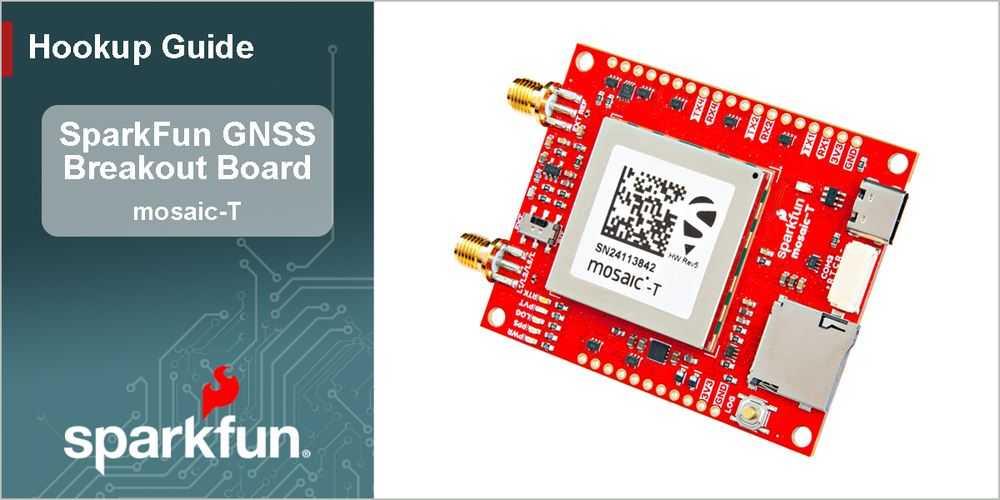
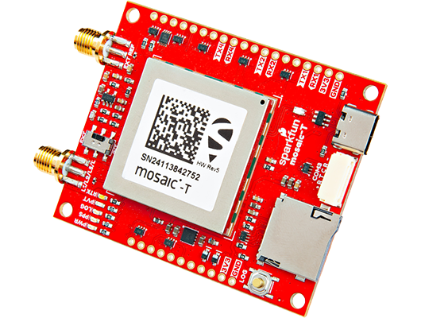
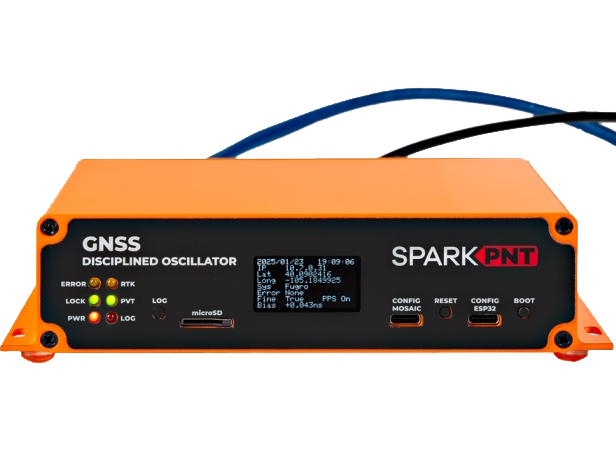

<figure markdown>

</figure>

---

# Introduction

-   <a href="https://www.sparkfun.com/sparkfun-timing-gnss-breakout-mosaic-t.html">
	**GNSS Timing Breakout - mosaic-T** 
	**SKU:** GPS-28731

	---

	<figure markdown>
	
	</figure></a>

	<article style="text-align: center;" markdown>
	{ .tinyqr }[Purchase from SparkFun :fontawesome-solid-cart-plus:{ .heart }](https://www.sparkfun.com/sparkfun-timing-gnss-breakout-mosaic-t.html){ .md-button .md-button--primary }
	</article>

-   At the heart of our Timing GNSS Breakout is [Septentrio](https://www.septentrio.com/en)'s mosaic-T, a compact, ultra-low power, multi-band, multi-constellation, high-precision GNSS timing receiver. It can acheive a timing precision of 5ns (5 billionths of a second), or better than 1ns with an optional subscription to the Fugro AtomiChron® L-band timing service. Event accuracy is better than 20ns. It also features Septentrio's unique [AIM+ technology](https://www.septentrio.com/en/learn-more/advanced-positioning-technology/aim-jamming-protection) for interference mitigation and anti-spoofing, ensuring best-in-class reliability and accuracy.

	This board provides easy access to the mosaic-T's reference clock to create your own [GNSS disciplined oscillator](https://en.wikipedia.org/wiki/GPS_disciplined_oscillator). You can use the computed `RxClkBias` from the `PVTCartesian` or `PVTGeodetic` SBF blocks of the mosaic-T to discipline your own 10MHz oscillator. The **EXT REF** SMA connector accepts **50&ohm;**, **10MHz** signals within a range of **-14dBm** *(min)* to **+14dBm** *(max)*. The `INT`/`EXT` slide switch selects the internal or external oscillator.

	The mosaic-T is a sophisticated timing receiver running an internal web server that can be accessed through the USB interface with a standard browser using a Linux/Windows computer. Septentrio also provides dozens of [video tutorials](https://www.youtube.com/@SeptentrioGNSS/videos) to guide users through the configuration settings of their GNSS receivers utilizing the web interface.

	Beyond the capabilities of the mosaic-T module, this board is seamless to operate with no programming skills required. Gone are the times when a microcontroller was required to interface with the GNSS receiver and log data to an SD card and when users had to carry around an SD card reader to extract the data from the SD card. The Timing GNSS Breakout - mosaic-T  can start/stop logging data or mount/unmount the SD card, without a single line of code, just utilizing a simple button. For the users who prefer a command-line interface, Septentrio has you covered. Users can still control and configure the mosaic-T module through a CLI, which is useful for scenarios such as production line testing *(in fact, that is how we tested this board)*.

	This breakout board is a perfect middle ground for users who would like to integrate the mosaic-T module into a project/enclosure with access to a majority of the module's available pins, similar to Septentrio's developer kit, but in the smaller form factor of their evaluation kit. Or maybe... you just needed a very accurate PPS output at a 3.3V logic level. *Please, check out the rest of our [hookup guide](hardware_overview.md) for more details on the capabilities of this board (that we couldn't fit in this product description).*

	!!! warning "RTK Not Supported"
		The mosaic-T is a superb GNSS module designed for highly accurate timing applications. **But it does not support RTK. It can not be configured as a RTK Rover or Base. RTCM output is not supported.**

!!! danger "Important: Read Before Use!"
	!!! warning "ESD Sensitivity"
		The mosaic-T module is sensitive to [ESD](https://en.wikipedia.org/wiki/Electrostatic_discharge "Electrostatic Discharge"). Use a proper grounding system to make sure that the working surface and the components are at the same electric potential.

		??? info "ESD Precautions"
			As recommended by the manufacturer, we highly recommend that users take the necessary ESD precautions to avoid damaging their module.

			

			

			<article class="video-500px" style="text-align: center; margin: auto;" markdown>
			<iframe src="https://www.youtube.com/embed/hrL5J6Q5gX8?si=jOPBat8rzMnL7Uz4&amp;start=26;&amp;end=35;" title="Septentrio: Getting Started Video (playback starts at ESD warning)" frameborder="0" allow="accelerometer; autoplay; clipboard-write; encrypted-media; gyroscope; picture-in-picture" allowfullscreen></iframe>
			{ .qr }
			</article>

			

			-   <a href="https://www.sparkfun.com/ifixit-anti-static-wrist-strap.html">
				<figure markdown>
				
				</figure>

				---

				**iFixit Anti-Static Wrist Strap** 
				TOL-25572</a>

			

	!!! warning "Active Antenna"
		Never inject an external DC voltage into the SMA connector for the GNSS antenna, as it may damage the mosaic-T module. For instance, when using a splitter to distribute the antenna signal to several GNSS receivers, make sure that no more than one output of the splitter passes DC. Use [DC-blocks](https://en.wikipedia.org/wiki/DC_block) otherwise.

??? question "Product Comparison"
	Below is a simple comparison table between our breakout board and Septentrio's development and evaluation kits:

	

	<table markdown>
	<tr markdown>
	<td></td>
	<th markdown style="text-align:center">
		mosaic-T Development Kit 
		

		<figure markdown>
		{ width="200" }
		</figure>
	</th>
	<th markdown style="text-align:center">
		mosaic-T GNSS Breakout 
		

		<figure markdown>
		{ width="200" }
		</figure>
	</th>
	<th markdown style="text-align:center">
		GNSS Disciplined Oscillator 
		

		<figure markdown>
		{ width="200" }
		</figure>
	</th>
	</tr>
	<tr>
		<td style="vertical-align:middle;">GNSS Antenna</td>
		<td style="text-align:center; vertical-align:middle;">Dual</td>
		<td style="text-align:center; vertical-align:middle;">Single</td>
		<td style="text-align:center; vertical-align:middle;">Single</td>
	</tr>
	<tr>
		<td>USB Connector</td>
		<td style="text-align:center">micro-B</td>
		<td style="text-align:center">Type-C</td>
		<td style="text-align:center">Type-C</td>
	</tr>
	<tr>
		<td style="vertical-align:middle;">Ethernet</td>
		<td style="text-align:center; vertical-align:middle;">
			Yes 
			<i>10/100 Base-T</i>
		</td>
		<td style="text-align:center; vertical-align:middle;">No</td>
		<td style="text-align:center">
			Yes 
			<i>10/100 Base-T</i>
		</td>
	</tr>
	<tr>
		<td style="vertical-align:middle;">WiFi</td>
		<td style="text-align:center; vertical-align:middle;">No</td>
		<td style="text-align:center; vertical-align:middle;">No</td>
		<td style="text-align:center">
			Yes - Network Bridge 
			<i>10 Base-T</i>
		</td>
	</tr>
	<tr>
		<td style="vertical-align:middle;">COM Ports</td>
		<td style="text-align:center">4</td>
		<td style="text-align:center">4</td>
		<td style="text-align:center">
			1 - mosaic-T 
			1 - ESP32
		</td>
	</tr>
	<tr>
		<td>&micro;SD Card Slot</td>
		<td style="text-align:center">Yes</td>
		<td style="text-align:center">Yes</td>
		<td style="text-align:center">Yes</td>
	</tr>
	<tr>
		<td style="vertical-align:middle;">Reset/Log Buttons</td>
		<td style="text-align:center; vertical-align:middle;">Yes</td>
		<td style="text-align:center; vertical-align:middle;">Yes</td>
		<td style="text-align:center; vertical-align:middle;">Yes</td>
	</tr>
	<tr>
		<td style="vertical-align:middle;">Logic-Level</td>
		<td style="text-align:center">
			1.8V 
			3.3V
		</td>
		<td style="text-align:center; vertical-align:middle;">3.3V</td>
		<td style="text-align:center">
			3.3V 
			5V
		</td>
	</tr>
	<tr>
		<td>PPS Signal</td>
		<td style="text-align:center">Header Pin</td>
		<td style="text-align:center">PTH Pad</td>
		<td style="text-align:center">SMA Connector</td>
	</tr>
	<tr>
		<td>External Ref. Signal</td>
		<td style="text-align:center">SMA Connector</td>
		<td style="text-align:center">SMA Connector</td>
		<td style="text-align:center">SMA Connector</td>
	</tr>
	<tr>
		<td>Enclosure Material</td>
		<td style="text-align:center; vertical-align:middle;">N/A</td>
		<td style="text-align:center; vertical-align:middle;">N/A</td>
		<td style="text-align:center; vertical-align:middle;">Aluminum</td>
	</tr>
	<tr>
		<td style="vertical-align:middle;">Dimensions</td>
		<td style="text-align:center; vertical-align:middle;">N/A</td>
		<td style="text-align:center; vertical-align:middle;">63.5 x 50.8 x 0.8cm</td>
		<td style="text-align:center">
			180.6 x 101.8 x 4.1cm 
			<i>Enclosure Only</i>
		</td>
	</tr>
	<tr>
		<td style="vertical-align:middle;">Weight</td>
		<td style="text-align:center; vertical-align:middle;">N/A</td>
		<td style="text-align:center; vertical-align:middle;">23g</td>
		<td style="text-align:center">
			415g 
			<i>Enclosure Only</i>
		</td>
	</tr>
	
	</table>
	
	

---

In this guide we'll cover how to setup the mosaic-T Timing GNSS breakout board. Additionally, we also provide some guidelines for creating a [GNSS disciplined oscillator](https://en.wikipedia.org/wiki/GPS_disciplined_oscillator), based upon our work with the [SparkPNT GNSSDO](https://www.sparkfun.com/sparkpnt-gnss-disciplined-oscillator.html). To follow along with this tutorial, at a minimum, users will need the following items:

- Computer with an operating system (OS) that is compatible with all the software installation requirements (1)

	!!! warning "Software Compatibility"
		The [RxTools software suite](https://www.septentrio.com/en/products/gps-gnss-receiver-software/rxtools) from Septentrio, automatically installs the required USB-over-Ethernet driver and provides users with an interface for the receiver configuration, monitoring, data logging, and analysis. However, it only appears to be available for Windows and Linux operating systems.

- [USB 3.1 Cable A to C - 3 Foot](https://www.sparkfun.com/usb-3-1-cable-a-to-c-3-foot.html) - Used to interface with the mosaic-T GNSS Breakout (2)
- [SparkFun GNSS Timing Breakout - mosaic-T](https://www.sparkfun.com/sparkfun-timing-gnss-breakout-mosaic-t.html) (3)
- [GNSS Multi-Band L1/L2/L5 Surveying Antenna](https://www.sparkfun.com/gnss-multi-band-l1-l2-l5-surveying-antenna-tnc-spk6618h.html)
	- [SMA Male to TNC Male Cable](https://www.sparkfun.com/reinforced-interface-cable-sma-male-to-tnc-male-10m.html)
	- [Antenna Mount](https://www.sparkfun.com/gnss-magnetic-antenna-mount-5-8-11-tpi.html)

1. A list of the compatible GNSS receiver software, is provided on the [Septentrio website](https://www.septentrio.com/en/products/gps-gnss-receiver-software).
1. If your computer doesn't have a USB-A slot, then choose an appropriate cable or adapter.
1. For the best performance, use a compatible L1/L2/L5/L-Band GNSS antenna.

-   <a href="https://www.sparkfun.com/usb-3-1-cable-a-to-c-3-foot.html">
	<figure markdown>
	
	</figure>

	---

	**USB 3.1 Cable A to C - 3 Foot** 
	CAB-14743</a>

-   <a href="https://www.sparkfun.com/sparkfun-timing-gnss-breakout-mosaic-t.html">
	<figure markdown>
	
	</figure>

	---

	**GNSS Timing Breakout - mosaic-T** 
	GPS-28731</a>

-   <a href="https://www.sparkfun.com/gnss-multi-band-l1-l2-l5-surveying-antenna-tnc-spk6618h.html">
	<figure markdown>
	
	</figure>

	---

	**GNSS Multi-Band L1/L2/L5 Surveying Antenna - TNC (SPK6618H)** 
	GPS-21801</a>

-   <a href="https://www.sparkfun.com/reinforced-interface-cable-sma-male-to-tnc-male-10m.html">
	<figure markdown>
	
	</figure>

	---

	**Reinforced Interface Cable - SMA Male to TNC Male (10m)** 
	CAB-21740</a>

-   <a href="https://www.sparkfun.com/gnss-magnetic-antenna-mount-5-8-11-tpi.html">
	<figure markdown>
	
	</figure>

	---

	**GNSS Magnetic Antenna Mount - 5/8" 11-TPI** 
	PRT-21257</a>

-   <a href="https://www.sparkfun.com/ifixit-anti-static-wrist-strap.html">
	<figure markdown>
	
	</figure>

	---

	**iFixit Anti-Static Wrist Strap** 
	TOL-25572</a>

	??? warning "ESD Protection"
		The Septentrio mosaic-T module is sensitive to [ESD](https://en.wikipedia.org/wiki/Electrostatic_discharge "Electrostatic Discharge"). As recommended by the manufacturer, we highly recommend that users take the necessary precautions to avoid damaging their module. Use a proper grounding system to make sure that the working surface and the components are at the same electric potential.

## Section Topics
This guide is divided into three sections:

- The **Hardware** section has two sub-sections that provide:
	- An overview of the board's design, major components, and interfaces. Refer to this page for information on the connectors, breakout pins, and jumpers.
	- Assembly instructions for this product's interfaces.
- The **Software** section has several sub-sections. The mosaic-T module has numerous capabilities and a multitude of ways to configure and interface with them. Without regurgitating all the information that is documented in Septentrio's user manuals and videos, we have tried to highlight a good majority of the module's aspects.
- In the **Resources** and **Support** sections, users can find the design files (KiCad files & schematic), relevant documentation (datasheets, white papers, etc.) and other helpful links on the Resources page. Lastly, the **Troubleshooting Tips** page includes helpful tips and instructions for how to receive technical support from SparkFun.
