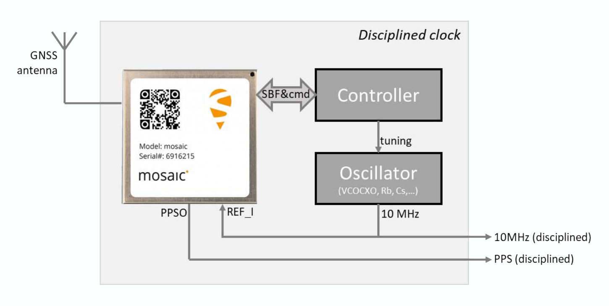

!!! info
	This section describes a possible setup for a 10 MHz disciplined clock using the mosaic-T as a precision time source, which is particularly suitable in combination with Fugro AtomiChron^&reg;^ service. For more details, please refer to **Appendix D** of the [hardware manual](./assets/component_documentation/mosaic_hardware_manual_v1.9.0.pdf) and [firmware manual](./assets/component_documentation/firmware/mosaic-T_Firmware_v4.14.10.1_Reference_Guide.pdf).


!!! warning
	If the reference clock switch is set to `EXT`, users must provide a 10MHz input signal. Otherwise, the mosaic-T module will cease to operate, without a clock signal. Additionally, switching between external and internal frequency references must occur when the module is powered off, or the module must be reset after switching.


## Hardware Setup
The mosaic-T utilizes the 10-MHz signal from the steered oscillator as frequency reference, instead of its own internal crystal oscillator. An external controller, then reads the clock bias reported from the mosaic-T module in its SBF messages and steers it to zero by adjusting the frequency of the oscillator. When the clock bias is zero, the receiver time scale is aligned with GNSS time. Unlike traditional approaches, this architecture does not require any hardware to measure time delays.

<figure markdown>
[{ width="600" }](./assets/img/hookup_guide/disciplined_clock.png "Click to enlarge")
<figcaption markdown>The setup for a disciplined clock with a mosaic-T module, controller, and a tunable oscillator.</figcaption>
</figure>


## Software Configuration

### mosaic-T
Users will configure the mosaic-T module to disable the PPS pulses and perform an initial synchronization to GNSS time on boot. These configurations are set by entering the SBF commands below. The commands only have to be entered once, as the last `exeCopyConfigFile` command makes them persistent in the boot configuration.


!!! serial
	These configurations are set by entering the following SBF commands:

	```bash
	setPPSParameters, off
	setClockSyncThreshold, usec500, on
	```

	To save the configurations to the module, enter the following SBF command:

	```bash
	exeCopyConfigFile, Current, Boot
	```


!!! info
	Refer to the [firmware manual](./assets/component_documentation/firmware/mosaic-T_Firmware_v4.14.10.1_Reference_Guide.pdf) for a more detailed description of these commands.


### Controller
At each subsequent (re)start of the system, the controller will need to execute the following algorithm:

1. Enable the output of the `PVTCartesian` (or `PVTGeodetic`) and of the `ReceiverTime` SBF blocks to the controller at a desired rate *(1Hz, in the example below)*.


	!!! serial
		These configurations are set by entering the following SBF commands:

		```bash
		setSBFGroups, Group1, PVTGeodetic+ReceiverTime
		setSBFOutput, Stream1, COM1, Group1, sec1
		```

		To save the configurations to the module, enter the following SBF command:

		```bash
		exeCopyConfigFile, Current, Boot
		```


1. Wait until the `FINETIME` bit is set in the `SyncLevel` field of the `ReceiverTime` SBF block. This indicates that the receiver's time initialization is complete.
1. Each time the `PVTCartesian` block is received by the controller, read the clock bias from its `RxClkBias` field.
1. The initial clock bias should be small (typically <200ns)
	- If the value is positive, adjust the tuning level to slightly decrease the oscillator frequency.
	- If the value is negative, adjust the tuning level to slightly increase the oscillator frequency.
1. Continue this process above, until the clock bias has converged to zero.
	- While steering the oscillator frequency, it is recommended to keep the rate of frequency change smaller than 3 ppb per second *(i.e. not to change the 10-MHz frequency by more than 0.03 Hz per second)*.
1. Once a lock is achieved, the receiver time will be synchronized with the GNSS time.
	- Users can then, enable the PPS signal from the mosaic-T in **RxClock** mode using the `setPPSParameters` command.


		!!! serial
			These configurations are set by entering the following SBF command:

			```bash
			setPPSParameters, <Interval>, <Polarity>, <Delay>, <TimeScale>, <MaxSyncAge>, <PulseWidth>
			```

			To save the configurations to the module, enter the following SBF command:

			```bash
			exeCopyConfigFile, Current, Boot
			```


		!!! info
			In RxClock mode, the PPS pulses will be aligned with the receiver's time and locked to the 10-MHz reference signal from the oscillator. *(i.e. Assuming a 1Hz PPS rate, the pulses will be generated exactly every 10 million cycles of the oscillator, in a constant phase with respect to the oscillator cycles.)*


1. Continue steering the clock bias to zero to keep the oscillator and the PPS aligned with the GNSS time.
	- During GNSS signal outages, the PPS pulses from the module will remain phase locked to the oscillator. The stability of the hold-over period, will depend on the quality of the oscillator.


!!! tip
	When using [Fugro's AtomiChron^&reg;^ service](fugro_atomichron.md), the reported clock will initially refer to the GNSS time scale during the first two to three minutes after start up, before switching to the AtomiChron^&reg;^ time scale. The change between reference time scales, may lead to a clock bias shift by a couple of nanoseconds. The reference time scale is reported in the `TimeSystem` field of the `PVTCartesian` SBF block and the jump can be avoided by waiting until that field is set to *Fugro AtomiChron* (`100`).


!!! note "Timing Delay"
	The PPS aligned signal, as described above, will typically be late by a few tens of nanoseconds. This is due to delays from the antenna, cables and RF frontend of the receiver.
		- In the mosaic modules, the frontend RF delay is about 10 ns.
		- Typical values for the antenna delay range from 10 to 20 ns, and coax cable delay amounts to about 5 ns per meter.
		- If the total delay is known, it can be compensated with the `setCalibCommonDelay` SBF command.
